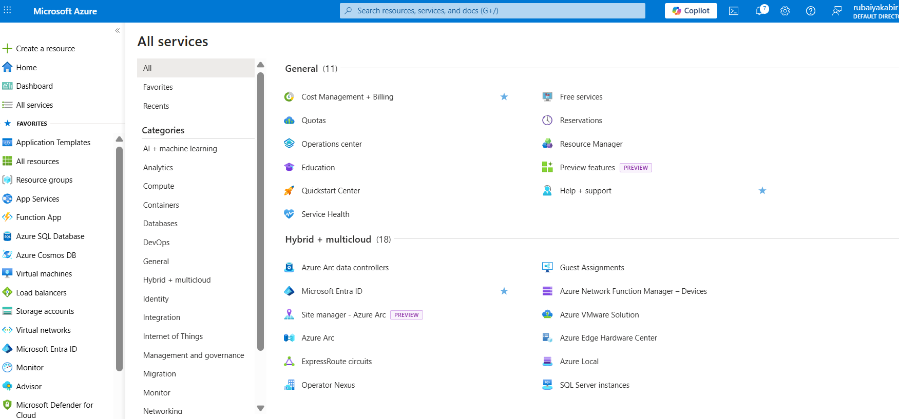
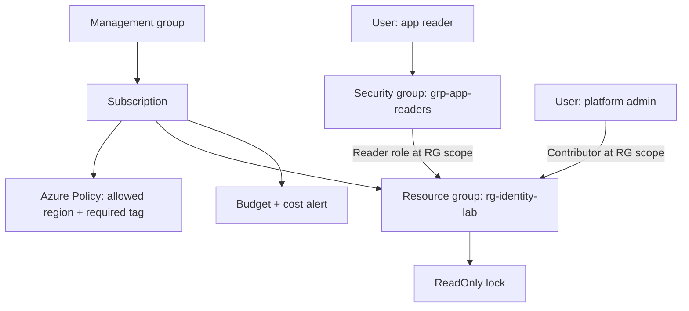
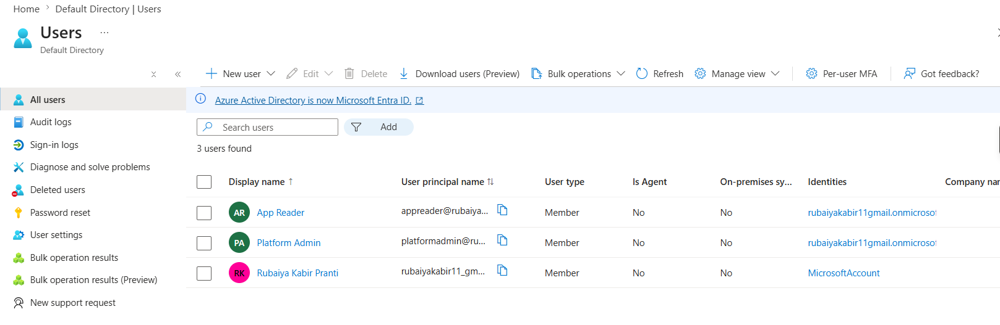
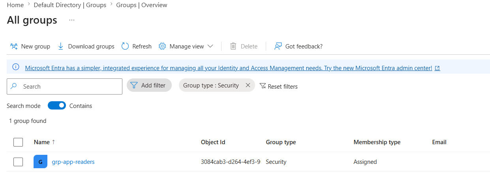
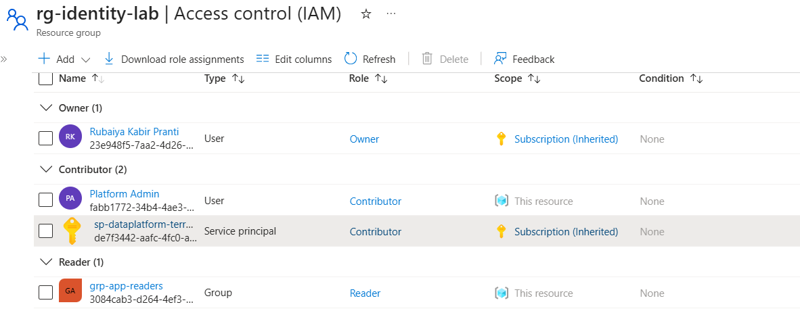
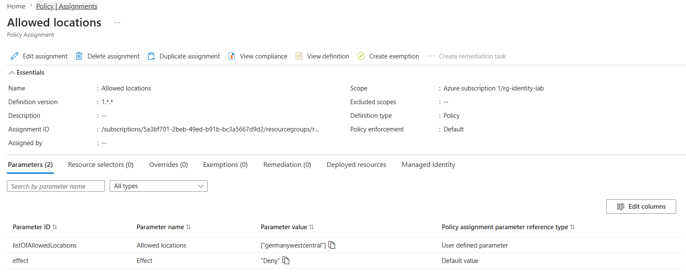
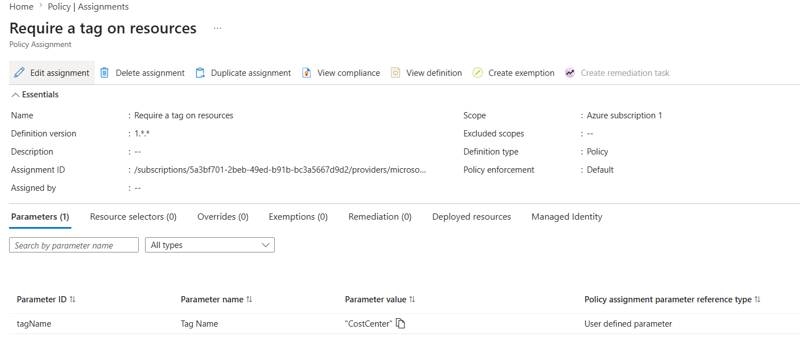
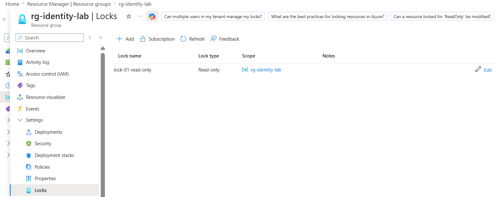
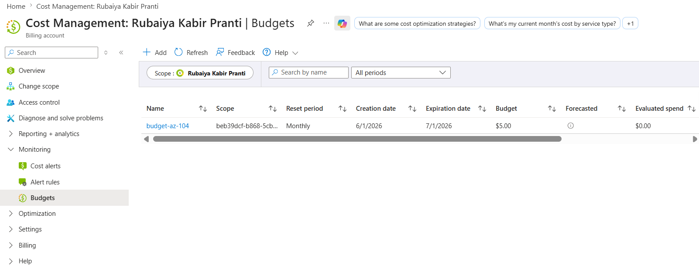

# 🔐 Azure Identity & Governance (AZ-104, portal-built)

This is the first lab in my AZ-104 set. The whole thing is done in the Azure portal, on purpose, because that is how I sit the exam and it is where the small configuration details live.

The scenario: I have just been handed a fresh subscription for a small team and been told to set it up properly. That means people can sign in, the right people can touch the right things, nobody can create resources in the wrong region or without a cost tag, and a couple of important resources cannot be deleted by accident. This lab is mostly portal navigation and reading the validation messages that policies and locks produce.

## 🏗️ What I build here

## ✅ Before I started
- An Azure subscription where I am the Owner (a free account is fine).
- About 20 minutes.

## 🪪 Understanding the UPN (read this before Phase 1)

A **UPN (User Principal Name)** is the sign-in name for a user in Microsoft Entra ID. It is formatted like an email address: a name part, the `@` symbol, and a domain, for example `appreader@mytenant.onmicrosoft.com`.

The important point: I do not invent or type the domain part. Every Azure tenant is created with a default domain that looks like `<tenantname>.onmicrosoft.com`. When I create a user in the portal, the User principal name field is split into two parts:
- a **text box** where I type only the name part (for example `appreader`), and
- a **dropdown** that is already filled in with my tenant's domain.

So I only ever type the part before the `@`. The portal joins it to the domain for me.

To see my tenant domain before I start: in the portal, search for **Microsoft Entra ID**, open it, and on the **Overview** page look at the **Primary domain** value. That is the `<tenantname>.onmicrosoft.com` that will appear in the dropdown.

## 👥 Phase 1 - Creating users and a group (Microsoft Entra ID)

### Create the two users
🚀 Sign in to the Azure portal at `portal.azure.com` using my Owner account.
☁️ In the search bar at the top, type **Microsoft Entra ID** and select it from the results.
👤 In the left-hand menu of Microsoft Entra ID, select **Users**.
➕ Select **+ New user**, then **Create new user**.
📋 On the **Basics** tab, fill in:
   - **User principal name**: in the text box type `appreader`. Leave the dropdown on the default `<tenantname>.onmicrosoft.com`. The full UPN becomes `appreader@<tenantname>.onmicrosoft.com`.
   - **Display name**: `App Reader`.
   - **Password**: either let the portal auto-generate one (select **Auto-generate password** and copy it) or choose my own. I write this down, because I will use it later to test sign-in.
✅ Select **Review + create**, then **Create**.
🔄 Repeat the previous steps to create the second user:
   - **User principal name**: `platformadmin` (full UPN `platformadmin@<tenantname>.onmicrosoft.com`).
   - **Display name**: `Platform Admin`.

### Create the security group
👥 In the Microsoft Entra ID left-hand menu, select **Groups**.
➕ Select **+ New group**.
🔐 Set **Group type** to **Security**.
🏷️ Set **Group name** to `grp-app-readers`.
👤 Next to **Members**, select **No members selected**, find **App Reader** in the list, tick it, and choose **Select**.
✅ Select **Create**.

**Important detail:** A **Security** group can be used for Azure role assignments, which is what this lab needs. A **Microsoft 365** group is a different object intended for collaboration (shared mailbox, calendar) and is not used for Azure RBAC here. Separately, if I ever want to assign **Entra ID directory roles** (not Azure resource roles) to a group, I must enable **"Microsoft Entra roles can be assigned to the group"** at the moment I create the group. This option cannot be turned on after the group already exists.

## 🔑 Phase 2 - Access (RBAC)

### Create the resource group
☁️ In the search bar, type **Resource groups** and select it.
➕ Select **+ Create**.
⚙️ Set **Subscription** to my subscription, **Resource group** name to `rg-identity-lab`, and **Region** to my chosen region.
✅ Select **Review + create**, then **Create**.

### Assign roles on the resource group
📂 Open the resource group `rg-identity-lab`.
🔐 In its left-hand menu, select **Access control (IAM)**.
➕ Select **+ Add**, then **Add role assignment**.
🔑 On the **Role** tab, search for **Reader**, select it, and choose **Next**.
👤 On the **Members** tab, set **Assign access to** to **User, group, or service principal**, select **+ Select members**, find `grp-app-readers`, select it, and choose **Select**.
✅ Select **Review + assign**.
🔄 Repeat the previous steps, but this time choose the **Contributor** role and assign it to the **Platform Admin** user (set **Assign access to** to **User, group, or service principal** and pick the user).

### Sign in as the Platform Admin user
I am still signed in as the Owner, so I test the Platform Admin account in a **separate browser session**. This keeps my Owner session intact and avoids signing myself out.

🌐 Open a new **private / incognito** browser window (`Ctrl+Shift+N` in Chrome or Edge, `Ctrl+Shift+P` in Firefox).
🔗 Go to `portal.azure.com`.
🚀 Sign in with the Platform Admin UPN, `platformadmin@<tenantname>.onmicrosoft.com`, and the temporary password I saved when I created the user.
🔑 On first sign-in, Azure requires me to **change the password**. I set a new one and note it.
🔐 If the tenant has **security defaults** enabled (new tenants do by default), I am also shown a **"More information required"** prompt to register multi-factor authentication. I follow it (normally installing the Microsoft Authenticator app and scanning the QR code). This is a one-time setup.
✅ I am now signed in as Platform Admin, who holds **Contributor** on `rg-identity-lab`.

### Confirm that Contributor cannot grant access
📂 In the Platform Admin (incognito) session, open the resource group `rg-identity-lab`.
➕ Select **Access control (IAM)** > **+ Add** > **Add role assignment**, and try to assign any role to another user.
❌ The attempt fails: the role assignment cannot be saved. This demonstrates that **Contributor can create and manage resources but cannot grant access to others.** Granting access requires the **Owner** or **User Access Administrator** role.
🔙 I close the incognito window and continue as the Owner.

### Understanding scope and inheritance
Azure RBAC scopes are arranged in a hierarchy, from broadest to narrowest:

**Management group → Subscription → Resource group → Individual resource**

When I assign a role at one level, it applies to that level **and to everything beneath it**. This downward flow is called **inheritance**.

What that means for the Reader assignment in this lab:
- If I had assigned **Reader** to `grp-app-readers` at the **subscription** level, the group would be able to read **every** resource group and every resource in that subscription.
- Instead, I assigned **Reader** at the **resource group** level, on `rg-identity-lab` only. So the group can read what is inside that one resource group and has **no access** to any other resource group in the subscription.

This is the practical meaning of least privilege: I grant access at the narrowest scope that still does the job, so the permission does not reach places it was never meant to.

A mental model I keep:
- **RBAC** = what a *person* can do to *resources*.
- **Entra ID directory roles** (Global Administrator, User Administrator, and so on) = what a person can do in the *directory*.
- **Azure Policy** = what a *resource* is even allowed to *be*.

## 🛡️ Phase 3 - Guardrails (Azure Policy)

### Restrict allowed regions
☁️ In the search bar, type **Policy** and select it.
📋 In the left-hand menu, select **Assignments**, then **Assign policy**.
🎯 Set the **Scope** to my subscription (or to `rg-identity-lab`).
🔍 Next to **Policy definition**, select the browse button, search for **Allowed locations**, and select the built-in definition.
📍 On the **Parameters** tab, set the allowed location to my single region.
✅ Select **Review + create**, then **Create**.
🧪 Attempt to create any resource in a *different* region. It is blocked at the validation step with a policy error message.

### Require a cost tag
➕ Select **Assign policy** again.
🎯 Set the **Scope** as before.
🔍 For **Policy definition**, search for and select the built-in **Require a tag on resources**.
🏷️ On the **Parameters** tab, set the tag name to `CostCenter`.
✅ Select **Review + create**, then **Create**.
🧪 Attempt to create a resource without that tag. It is blocked.

**Important detail:** Existing non-compliant resources are not deleted. They are flagged as non-compliant, while only *new* resources are blocked by a `Deny` effect. Also, tags are **not** inherited from the resource group automatically. To make a resource inherit a tag, I use a policy with a `Modify` or `Append` effect.

## 🔒 Phase 4 - Locks and cost

### Add a resource lock
📂 Open `rg-identity-lab` (or a single resource inside it).
⚙️ In the left-hand menu, select **Settings**, then **Locks**.
🔒 Select **+ Add**, give the lock a name, set **Lock type** to **ReadOnly**, and select **OK**.
🧪 Attempt to delete the resource group. It is blocked. Attempt to modify it. It is also blocked.
🔄 Edit the lock and change **Lock type** to **CanNotDelete**. Now modification is allowed again, but deletion is still blocked.

### Add a budget alert
☁️ In the search bar, type **Cost Management** and select it (or open the subscription and select **Cost Management** in its menu).
💰 Select **Budgets**, then **+ Add**.
📊 Set a small monthly budget amount and a budget period.
📧 Add an alert condition at **80%** of the budget and enter an email recipient for the alert.
✅ Select **Create**.

**Important detail:** A budget alert **sends an email** when the threshold is reached. It does **not** stop, cap, or block the spend. This distinction is commonly tested.

## 🧯 Break it and fix it
Using a second account, I assign **Reader** (not Contributor) to myself at the resource-group scope, then attempt to create a storage account in that group. The creation fails. I read the error to work out why, then fix it by changing the assignment to **Contributor**, after which the creation succeeds. Doing this once makes the principle of least privilege concrete rather than abstract.

## 🎯 Key points this lab reinforces
- Contributor can create resources but cannot grant access; granting access is Owner or User Access Administrator.
- RBAC, Entra ID directory roles, and Azure Policy are three different systems and are easy to confuse.
- A `ReadOnly` lock blocks **both** modify and delete; a `CanNotDelete` lock blocks only delete.
- Budgets alert; they never block spending.
- Tags are not inherited unless a policy enforces it.
- A Security group is used for role assignments, not a Microsoft 365 group; role-assignable groups must be configured at creation time.

## 🏭 If this were production, not a lab
I would manage these policies and role assignments at a **management group** so they apply across every subscription at once, use **groups** for every assignment rather than individual users, and enable **PIM (Privileged Identity Management)** for just-in-time administrative access instead of standing Owner rights. This is out of scope for AZ-104, but I note it as a reminder of the real-world shape.

---
*Part of my AZ-104 hands-on set. Built in the portal. See `cli-reference/commands.md` for the same steps as `az` commands.*