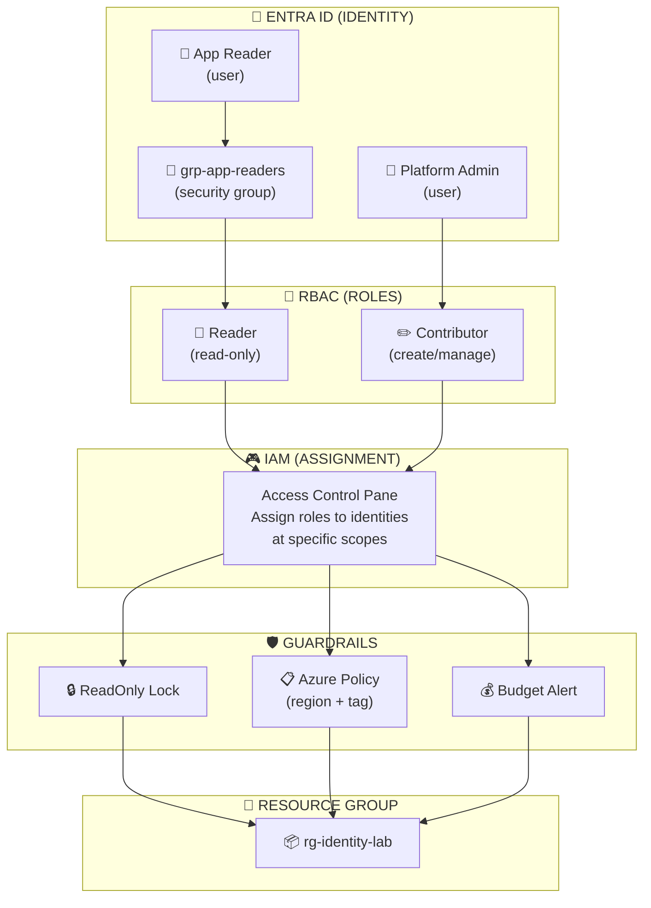
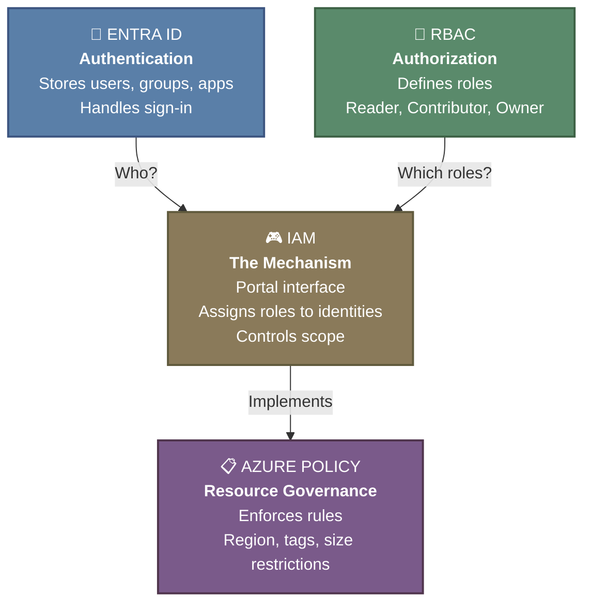
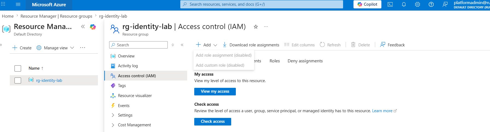

# 🔐 Azure Identity & Governance (AZ-104, portal-built)

This is the first lab in my AZ-104 set. The whole thing is done in the Azure portal, on purpose, it is where the small configuration details live.

**Exam status:** Not yet attempted. This lab builds foundational Azure governance skills tested in AZ-104.

## 📋 The Scenario

**Fictional assignment:**
I have just been handed a **fresh subscription for a small team** and been told to **set it up properly**.

**Responsibilities:**

**✓ People can sign in**
- Create users who can authenticate
- Set up groups for access management

**✓ Right people can touch the right things**
- Assign appropriate roles (Reader, Contributor, Owner)
- Use least privilege principle (narrow scope)
- Demonstrate that Contributor cannot grant access

**✓ Nobody can create resources in the wrong region**
- Enforce allowed locations via Azure Policy
- Block attempts to deploy outside approved regions

**✓ Nobody can create resources without a cost tag**
- Require a specific tag (e.g., `CostCenter`) on all resources
- Block creation if tag is missing

**✓ Important resources cannot be deleted by accident**
- Apply locks (ReadOnly or CanNotDelete)
- Protect against accidental destruction

**What I learn:**
- Mostly **portal navigation** and **reading validation messages**
- Understanding how policies and locks produce error messages when rules are violated
- These error messages are how Azure tells one why an action failed

## 🏗️ What I build here

## 🧭 Azure Governance: Core Concepts

**Four essential pieces that work together:**

**What each does:**

- **Entra ID (The "Who"):** Stores users, groups, and applications. Handles authentication (passwords, MFA). Verifies identity when someone signs in.

- **RBAC (The "What permissions"):** Defines roles like Reader, Contributor, Owner. Controls what each role can do to resources.

- **IAM (The "How to grant"):** Portal interface in "Access control (IAM)" pane where I assign roles to users, groups, or service principals. Controls scope (Subscription, Resource Group, or single Resource). Brings Entra ID and RBAC together.

- **Azure Policy (The "What is allowed"):** Enforces rules about what resources can be created. Controls region restrictions, required tags, allowed VM sizes. Blocks resource creation that violates policy.

## ✅ Before I started
- An Azure subscription where I am the Owner (a free account is fine).
- About 20 minutes.

## 🪪 Understanding the UPN (read this before Phase 1)

A **UPN (User Principal Name)** is the sign-in name for a user in Microsoft Entra ID. It is formatted like an email address: a name part, the `@` symbol, and a domain, for example `appreader@mytenant.onmicrosoft.com`.

The important point: I do not invent or type the domain part. Every Azure tenant is created with a default domain that looks like `<tenantname>.onmicrosoft.com`. When I create a user in the portal, the User principal name field is split into two parts:
- a **text box** where I type only the name part (for example `appreader`), and
- a **dropdown** that is already filled in with my tenant's domain.

So I only ever type the part before the `@`. The portal joins it to the domain for me.

To see my tenant domain before I start: in the portal, search for **Microsoft Entra ID**, open it, and on the **Overview** page look at the **Primary domain** value. That is the `<tenantname>.onmicrosoft.com` that will appear in the dropdown.

## 👥 Phase 1 - Creating users and a group (Microsoft Entra ID)

### 👤 Create the two users

**Setup:**
- Sign in to the Azure portal at `portal.azure.com` using Owner account
- Search for **Microsoft Entra ID** and open it
- Select **Users** from the left-hand menu
- Select **+ New user** > **Create new user**

**Create User 1 (App Reader):**
- **User principal name**: type `appreader` (full UPN: `appreader@<tenantname>.onmicrosoft.com`)
- **Display name**: `App Reader`
- **Password**: auto-generate or create custom (save this for testing later)
- Select **Review + create** > **Create**

**Create User 2 (Platform Admin):**
- **User principal name**: type `platformadmin` (full UPN: `platformadmin@<tenantname>.onmicrosoft.com`)
- **Display name**: `Platform Admin`
- **Password**: auto-generate or create custom (save this for testing later)
- Select **Review + create** > **Create**

### 👥 Create the security group

**Steps:**
- In Microsoft Entra ID, select **Groups** from the left-hand menu
- Select **+ New group**
- Set **Group type** to **Security**
- Set **Group name** to `grp-app-readers`
- Select **No members selected**, find **App Reader**, tick it, and choose **Select**
- Select **Create**

**Key detail:**
- **Security** groups are used for Azure role assignments (RBAC) ✓
- **Microsoft 365** groups are for collaboration (shared mailbox, calendar) and not used for RBAC ✗
- If assigning **Entra ID directory roles** to a group: enable **"Microsoft Entra roles can be assigned to the group"** at creation time (cannot be changed later)

## 🔑 Phase 2 - Access (RBAC)

### 📦 Create the resource group

- Set **Subscription** to my subscription
- Set **Resource group** name to `rg-identity-lab`
- Set **Region** to my chosen region
- Select **Review + create** > **Create**

### 🔐 Assign roles on the resource group

**Assign Reader role to the group:**
- Open resource group `rg-identity-lab`
- Select **Access control (IAM)** from the left-hand menu
- Select **+ Add** > **Add role assignment**
- On **Role** tab: search for and select **Reader** > **Next**
- On **Members** tab: set **Assign access to** to **User, group, or service principal**
- Select **+ Select members**, find `grp-app-readers`, select it, and choose **Select**
- Select **Review + assign**

**Assign Contributor role to Platform Admin:**
- Repeat the steps above but:
  - Select **Contributor** role instead of Reader
  - Select **Platform Admin** user instead of the group

### 🌐 Sign in as the Platform Admin user

**Why separate session?**
- Testing Platform Admin account in a separate browser session keeps my Owner session intact

**Setup:**
- Open a new **private / incognito** browser window:
  - Chrome/Edge: `Ctrl+Shift+N`
  - Firefox: `Ctrl+Shift+P`
- Go to `portal.azure.com`

**Sign in:**
- Use Platform Admin UPN: `platformadmin@<tenantname>.onmicrosoft.com`
- Use the temporary password from user creation

**First sign-in prompts:**
- Azure will require me to **change the password** - set a new one and note it
- If tenant has **security defaults** enabled (new tenants do by default):
  - Complete **"More information required"** for MFA registration
  - Install Microsoft Authenticator app and scan QR code
  - This is a one-time setup

**Result:**
- I am now signed in as Platform Admin with **Contributor** role on `rg-identity-lab`

### ⛔ Confirm that Contributor cannot grant access

**Test (in Platform Admin incognito session):**
- Open resource group `rg-identity-lab`
- Select **Access control (IAM)** > **+ Add** > **Add role assignment**
- Try to assign any role to another user
- **Attempt fails** - role assignment cannot be saved

**What this demonstrates:**
- ✓ Contributor can create and manage resources
- ✗ Contributor cannot grant access to others
- ⚠️ Only **Owner** or **User Access Administrator** can grant access

**Next:**
- Close the incognito window and continue as the Owner

### 📊 Understanding scope and inheritance

**RBAC hierarchy (broadest to narrowest):**
1. Management group (widest scope)
2. Subscription
3. Resource group
4. Individual resource (narrowest scope)

**Inheritance rule:**
- Roles assigned at one level apply to that level **and everything beneath it**
- This downward flow is called **inheritance**

**Example from this lab:**
- If Reader assigned to `grp-app-readers` **at subscription level**: group can read **every** resource in the subscription ✗
- Reader assigned to `grp-app-readers` **at resource group level** (`rg-identity-lab` only): group can read **only** that resource group ✓

**Least privilege principle:**
- Grant access at the **narrowest scope** that still does the job
- Prevents permissions from reaching unintended places

**Mental model:**
- **RBAC** = what a *person* can do to *resources*
- **Entra ID directory roles** = what a person can do in the *directory* (e.g., Global Administrator, User Administrator)
- **Azure Policy** = what a *resource* is even allowed to *be*

## 🛡️ Phase 3 - Guardrails (Azure Policy)

### 🌍 Restrict allowed regions

**Steps:**
- Search for **Policy** and open it
- Select **Assignments** > **Assign policy**
- Set **Scope** to my subscription (or `rg-identity-lab`)
- Next to **Policy definition**, select browse button
- Search for **Allowed locations** and select the built-in definition
- On **Parameters** tab: set allowed location to my single region
- Select **Review + create** > **Create**

**Test the policy:**
- Attempt to create any resource in a *different* region
- **Result:** blocked at validation step with policy error message

### 🏷️ Require a cost tag

**Steps:**
- Select **Assign policy** again
- Set **Scope** as before
- For **Policy definition**: search for and select built-in **Require a tag on resources**
- On **Parameters** tab: set tag name to `CostCenter`
- Select **Review + create** > **Create**

**Test the policy:**
- Attempt to create a resource without the tag
- **Result:** blocked

**Important details:**
- Existing non-compliant resources are **not** deleted - they are flagged as non-compliant
- Only **new** resources are blocked by a `Deny` effect policy
- Tags are **not** inherited from resource group automatically
- To make resources inherit tags: use policy with `Modify` or `Append` effect

## 🔒 Phase 4 - Locks and cost

### 🔒 Add a resource lock

**Steps:**
- Open `rg-identity-lab` (or a single resource inside it)
- Select **Settings** > **Locks** from the left-hand menu
- Select **+ Add**
- Give the lock a name
- Set **Lock type** to **ReadOnly**
- Select **OK**

**Test ReadOnly lock:**
- Attempt to delete the resource group - BLOCKED
- Attempt to modify it - BLOCKED

**Switch to CanNotDelete:**
- Edit the lock and change **Lock type** to **CanNotDelete**
- Attempt to modify - ALLOWED ✓
- Attempt to delete - BLOCKED ✗

**Lock comparison:**
- **ReadOnly**: blocks both modify and delete
- **CanNotDelete**: blocks only delete, allows modify

### 💰 Add a budget alert

**Steps:**
- Search for **Cost Management** and open it (or open subscription > **Cost Management**)
- Select **Budgets** > **+ Add**
- Set a small **monthly** budget amount
- Set **budget period** to Monthly
- Add **alert condition** at **80%** of budget
- Enter **email recipient** for the alert
- Select **Create**

**Critical detail:**
- Budget alerts **send an email** when threshold is reached
- They do **NOT** stop, cap, or block spending
- This distinction is commonly tested on AZ-104

## 🧯 Break it and fix it

**Scenario:**
- Using a second account, assign **Reader** (not Contributor) at resource-group scope
- Attempt to create a storage account in that resource group

**Result:**
- Creation **fails**

**Debug and fix:**
- Read the error message to understand why
- Change the assignment to **Contributor**
- Attempt creation again - **succeeds**

**Why this matters:**
- Makes the principle of least privilege concrete rather than abstract
- Demonstrates permission boundaries in practice

## 🎯 Key points this lab reinforces

**Access & permissions:**
- Contributor can create resources but **cannot** grant access
- Granting access requires **Owner** or **User Access Administrator** role
- **Least privilege**: assign at narrowest scope needed

**Three different systems (easy to confuse):**
- **RBAC** = person permissions to resources
- **Entra ID directory roles** = person permissions in the directory
- **Azure Policy** = what resources are allowed to be

**Locks:**
- `ReadOnly` lock blocks **both** modify and delete
- `CanNotDelete` lock blocks **only** delete (allows modify)

**Budgets & tags:**
- Budgets **alert** via email; they never block spending
- Tags are **not** inherited unless a policy enforces it

**Groups:**
- Use **Security** groups for role assignments ✓
- Use **Microsoft 365** groups for collaboration (not RBAC) ✗
- Role-assignable groups must be configured **at creation time**

## 🏭 If this were production, not a lab

**What to do differently:**

**Management & scope:**
- Manage policies and role assignments at **management group** level
- Apply automatically across **every subscription** at once

**Users & access:**
- Use **groups** for every assignment (not individual users)
- Enable **PIM (Privileged Identity Management)** for just-in-time administrative access
- Replace standing Owner rights with just-in-time elevation

**Note:**
- This production pattern is out of scope for AZ-104
- But important to recognize as the real-world shape of governance

---
*Part of my AZ-104 hands-on set. Built in the portal. See `cli-reference/commands.md` for the same steps as `az` commands.*