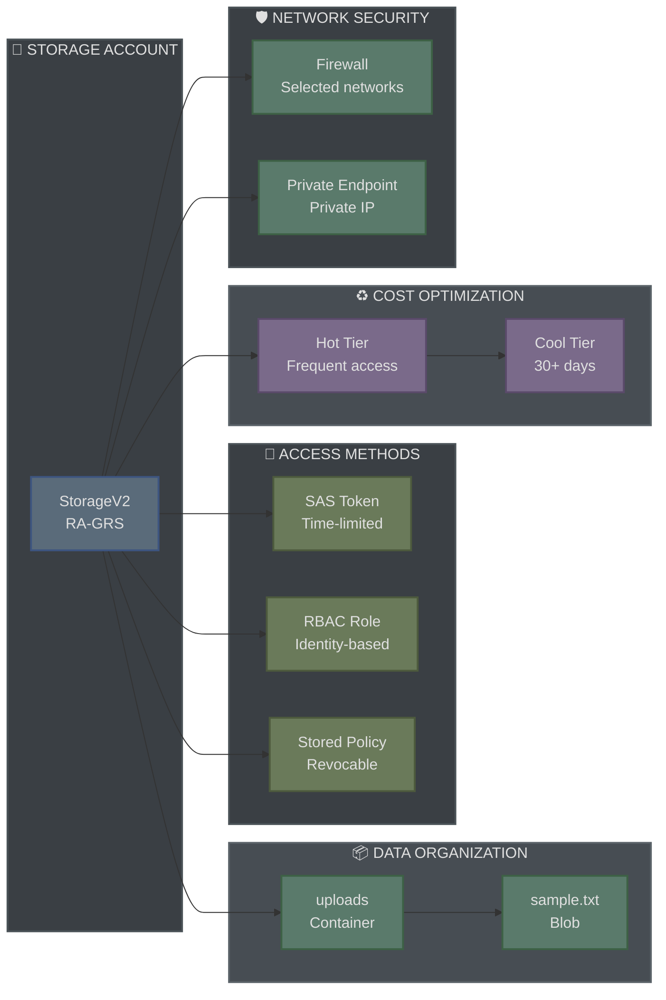
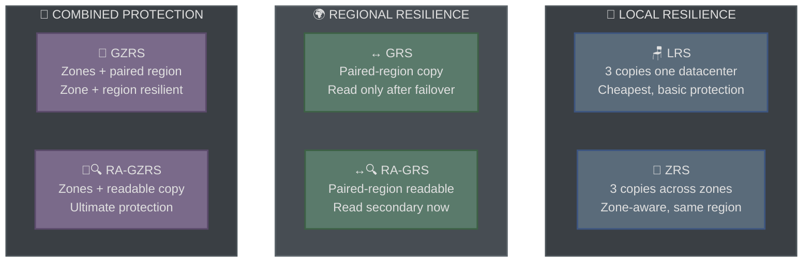

# 💾 Azure Storage: Redundancy, SAS, and Lifecycle (AZ-104, portal-built)

This is the second lab in my AZ-104 set. Storage appears simple at first. Then the exam asks me to choose between five redundancy options and four ways to grant access. They all sound similar. This lab shows the differences by building each one.

**Exam status:** Not yet attempted. This lab builds practical storage security and resilience skills tested in AZ-104.

## 📋 The Scenario

**Fictional assignment:**
I have been handed a requirement to **secure and manage file storage** for an app team.

**Responsibilities:**

**✓ Files survive infrastructure failures**
- Choose redundancy that protects against datacentre or region outages
- Allow audit access from another region without failover

**✓ External users access files securely**
- Contractor needs read-only access to one container
- Access valid for exactly one day
- No permanent credentials to leak

**✓ Costs decrease automatically**
- Old files move to cheaper storage tiers
- No manual intervention required

**✓ Network stays private**
- Storage reachable only from authorized VNets
- Block all public internet access

**What I learn:**
- How to choose the right redundancy model
- The difference between four access methods (each with trade-offs)
- Lifecycle rules that cut costs on their own
- Network security patterns (firewall, private endpoint, service endpoint)

## 🏗️ What I build here

## 🧠 Storage Core Concepts

**Five redundancy patterns:**

**Key distinctions:**

- **LRS vs ZRS:** LRS spreads copies across drives in one building. ZRS spreads across buildings (zones) in one region. ZRS costs more but survives zone outages.

- **GRS vs RA-GRS:** GRS copies to paired region asynchronously. I can read it only after a failover (disaster). RA-GRS (read-access) lets me read it now, without failover. I need RA- when an auditor must access the copy live.

- **GZRS and RA-GZRS:** Zone protection inside region, plus paired-region copy. Most expensive but maximum resilience.

## ✅ Before I started

- An Azure subscription where I am the Owner
- A small test file to upload
- About 45 minutes

## 📦 Phase 1 - Create the account and choose redundancy

### 💾 Create the storage account

**Steps:**
1. In the portal, search for **Storage accounts**
2. Select **Create**
3. Fill in basics: subscription, resource group, storage account name

**Account name rules:**
- Must be globally unique (I may not find my preferred name)
- Lowercase letters and numbers only
- 3 to 24 characters

### 🔄 Choose the redundancy option

**Five options explained:**

| Option | Protection | When to use |
|--------|-----------|-----------|
| **LRS** | 3 copies one datacenter | Dev/test, non-critical data, lowest cost |
| **ZRS** | 3 copies across zones (same region) | Needs zone resilience, stays in-region |
| **GRS** | LRS plus async copy in paired region | Needs region failover, can read only after failover |
| **RA-GRS** | GRS plus readable copy now (no failover) | Auditor needs live secondary copy |
| **GZRS / RA-GZRS** | Zone resilience plus paired region | Maximum protection |

**For this lab:**
I select **RA-GRS** because:
- The auditor needs to read a copy from another region **today**, not after a disaster
- The **RA-** prefix allows reading the secondary copy without a failover
- Plain GRS would hide the secondary copy until disaster strikes

*Choosing RA-GRS during storage account creation.*

### 📁 Create a container and upload a file

**Steps:**
1. After account creation, open the storage account
2. Select **Containers** from the left menu
3. Select **+ Container**
4. Name it `uploads`
5. Upload a test file into the container

**What I see:**
- The container is the storage **level below** the account
- Blobs (files) live inside containers
- Each container has its own access settings

## 🔐 Phase 2 - Four ways to grant access

Storage offers four access methods. Each has different security properties, and the exam tests the differences.

### 1️⃣ Account keys (full control)

**How it works:**
1. Open the storage account
2. Select **Access keys** from the left menu
3. Two keys appear. Each gives **full control** over the entire account

**Why I do not use this for external access:**
- No scoping (keys unlock **everything**)
- No time limit (key works forever)
- If leaked, I have no way to revoke it except rotating all keys (affects all users)

**When I use account keys:**
- Development and testing on my own machine
- Applications that need permanent access and run in a locked environment

**Screenshot note:** I always blur account keys in screenshots. They are credentials.

*Container and blob structure.*

### 2️⃣ SAS token (Shared Access Signature)

**Generate an ad-hoc SAS token:**
1. Select a blob or container
2. Select **Generate SAS**
3. Set **Permissions** to read-only
4. Set **Expiry** to one hour
5. Copy the **SAS URL**
6. Open the URL in a private browser tab - it works

**Why this is useful:**
- Scoped to a specific blob or container
- Time-limited (expires in one hour)
- Read-only (cannot write or delete)

**The problem with ad-hoc SAS:**
- Cannot revoke it before expiry - it works until the timer runs out
- If leaked, I am stuck waiting for it to expire

**Used for:**
- Contractor downloads a specific file for a few hours
- Sharing a temporary download link

### 3️⃣ Stored access policy (revocable SAS)

**Create a stored access policy:**
1. On the container, select **Access policy**
2. Select **+ Add policy**
3. Name: `contractor-read`
4. Permissions: read-only
5. Expiry: tomorrow

**Generate a SAS from this policy:**
1. Select **Generate SAS**
2. Link it to the policy I created
3. Copy the SAS URL

**Now I can revoke it:**
1. Delete the policy
2. Refresh the SAS URL - **it no longer works**

**Why this is production-safe:**
- SAS tied to a policy can be revoked instantly
- Ad-hoc SAS cannot be revoked at all

**Comparison on the exam:**
- The exam often asks: "How do I revoke a SAS that is already issued?"
- Answer: Use a stored access policy. Ad-hoc SAS cannot be revoked.

*A stored access policy on the uploads container.*

*After deleting the policy, the SAS stops working immediately.*

### 4️⃣ RBAC data roles (identity-based, most secure)

**Assign Storage Blob Data Reader role:**
1. Open the storage account
2. Select **Access control (IAM)**
3. Select **+ Add** - **Add role assignment**
4. Role: **Storage Blob Data Reader**
5. Assign to: the user or group
6. The user can now read blobs - no secrets needed

**Why this is the most secure:**
- No credential to leak (uses Azure AD sign-in)
- Can be revoked instantly by removing the role
- Auditable (who accessed what, when)
- Can use conditional access policies

**Data-plane vs control-plane:**
- Control-plane: managing the account (Owner, Contributor, Reader)
- Data-plane: reading blob data (Storage Blob Data Reader, Storage Blob Data Contributor)

**Common mistake:**
- Making someone Contributor on the account does **not** give them blob read access
- They need a **data-plane role** (Blob Data Reader) to actually read blobs

**Storage RBAC roles:**
- **Storage Blob Data Reader** - read blobs, list containers
- **Storage Blob Data Contributor** - read, write, delete blobs
- **Storage Blob Data Owner** - full control plus manage permissions
- **Storage Queue Data Reader** - read queue messages
- **Storage Queue Data Contributor** - read and send messages

*Storage Blob Data Reader role assigned to a user.*

## 📊 When to use each method

| Method | Scope | Expiry | Revocable | Use case |
|--------|-------|--------|-----------|----------|
| Account key | Entire account | Never | Complex | Dev/test only |
| Ad-hoc SAS | Blob or container | Time-based | No | Temporary shares <1 day |
| Stored policy SAS | Blob or container | Time-based | Yes | Contractors, partners |
| RBAC role | Resource group or account | Role removal | Yes | Employees, services (most secure) |

## ♻️ Phase 3 - Lifecycle management

Lifecycle rules automatically move blobs to cheaper tiers as they age. This cuts costs without manual intervention.

### 🔄 Create a lifecycle rule

**Steps:**
1. Open the storage account
2. Select **Lifecycle management** from the left menu
3. Select **+ Add rule**
4. Give the rule a name: `archive-old-data`
5. Set **If** to "Blobs modified more than 30 days ago"
6. Set **Then** to "Move to Cool storage"
7. Save the rule

**What happens:**
- All blobs older than 30 days automatically move to Cool tier
- This happens every night - I do not manage it

### 💰 The storage tiers and costs

| Tier | Access time | Cost | Use case |
|------|-------------|------|----------|
| **Hot** | Immediate | Most expensive | Frequent access |
| **Cool** | 30-day minimum hold | Cheaper | Infrequent access (backup, archives) |
| **Archive** | Offline, rehydration hours | Cheapest | Long-term retention |

**Important detail about Archive:**
- Archive blobs are **offline**
- I cannot read an archived blob directly
- I must **rehydrate** it first (takes 1-15 hours depending on priority)
- If a requirement says "instant read", Archive is ruled out

**Lifecycle example (this lab):**
1. Blobs start in **Hot** tier (immediate access)
2. After 30 days - move to **Cool** tier (slower, cheaper)
3. After 180 days - optionally move to **Archive** (cheapest, offline)

**Cost savings:**
- Hot: ~$0.016 per GB/month
- Cool: ~$0.008 per GB/month (50% cheaper)
- Archive: ~$0.002 per GB/month (87% cheaper)

*A lifecycle rule that moves blobs from Hot to Cool after 30 days.*

## 🛡️ Phase 4 - Network security

Storage accounts are public by default - anyone on the internet can reach them (though they need credentials to read data). Network security restricts access to trusted networks only.

### 🚪 Set up a firewall

**Steps:**
1. Open the storage account
2. Select **Networking** from the left menu
3. Select **Firewalls and virtual networks** tab
4. Change **Default action** from "Allow" to "Deny"
5. Add exceptions:
   - Add my current client IP (for admin access)
   - Add my VNet (for application servers)

**What this does:**
- Blocks the public endpoint from the internet
- Allows only specific IPs and VNets to reach the account

**Result:**
- My office IP: can access ✓
- A contractor's IP: blocked ✗
- Application servers in my VNet: can access ✓
- Random internet user: blocked ✗

*The firewall set to deny by default, then add specific networks.*

### 🔒 Add a private endpoint

Private endpoints give the storage account a **private IP** inside a VNet. This is different from restricting the public endpoint.

**Steps:**
1. Select **Private endpoints** from the left menu
2. Select **+ Create private endpoint**
3. Set scope to subscription and resource group
4. Set **Name** to `storage-pe`
5. Select **Resource: storage account**
6. Set **Target sub-resource** to `blob`
7. Set **Virtual network** to my VNet
8. Set **Subnet** to my chosen subnet
9. Review and create

**What I get:**
- Storage account accessible at a private IP (e.g., 10.0.1.5) inside my VNet
- The public endpoint still exists but is firewalled
- Applications in my VNet reach storage via the private IP

*A private endpoint gives the account a private IP inside a VNet.*

### 📍 Service endpoint vs private endpoint

These are often confused on the exam.

| Feature | Service Endpoint | Private Endpoint |
|---------|------------------|------------------|
| Cost | Free | Charged (small hourly fee) |
| IP type | Public (restricted) | Private (new IP) |
| VPN/ExpressRoute | No | Yes |
| On-premises access | No | Yes |
| Requires DNS changes | No | Yes (DNS record points to private IP) |

**Service endpoint:**
- Restricts the public endpoint to only my VNet
- Still a public IP, just firewalled
- Cloud-only (cannot reach from on-premises)
- Free

**Private endpoint:**
- Creates a new private IP inside my VNet
- Reachable from on-premises (over VPN or ExpressRoute)
- Requires DNS changes to route storage.blob.core.windows.net to private IP
- Small hourly charge

**Decision rule:**
- "Restrict to my VNet" → Service endpoint (free)
- "Private IP from on-premises" → Private endpoint (paid)

## 🧯 Break it and fix it

**Scenario:**
I set the firewall to **Deny** by default. I add no exceptions. Then I attempt to:
1. Access my blob from the portal
2. Access my blob through a SAS URL

Both fail.

**Debug and fix:**
- Read the error messages (they tell me the firewall is blocking)
- Options to fix:
  - Add my client IP to the firewall
  - Add my client IP range
  - Add "Allow trusted Microsoft services" (portal is a Microsoft service)
- Pick the right option and test again

**Why this matters:**
- Firewall misconfiguration is a real production issue
- I learn the error messages and how to read them
- I understand that "Allow trusted services" lets Azure portal and Azure CLI through

## 🎯 Key points this lab reinforces

**Redundancy (memorize these):**
- **LRS** = one datacenter, cheapest
- **ZRS** = zone resilient (same region), protects zone failures
- **GRS** = region failover (read only after disaster)
- **RA-GRS** = read secondary region now (auditor use case)
- **RA-** prefix = readable copy without failover

**Access methods (know the trade-offs):**
- Account key: unlimited scope, no expiry, cannot revoke - avoid for external users
- Ad-hoc SAS: scoped, time-limited, cannot revoke - contractor for a few hours
- Stored policy SAS: scoped, time-limited, revocable - contractor, partners
- RBAC role: identity-based, no secret, revocable immediately - employees, services (most secure)

**Lifecycle tiers:**
- Archive is offline - must rehydrate before read (takes hours)
- "Needs instant read" rules out Archive
- Lifecycle rules run automatically, no manual intervention needed

**Network security:**
- Firewall restricts public endpoint (free, cloud-only)
- Private endpoint creates private IP (paid, reaches on-premises)
- Service endpoint: keep public IP, restrict to VNet (free)
- Private endpoint: new private IP through Private Link (paid, on-premises capable)

**Common exam mistakes:**
- Confusing "can read data" with "can manage account" (data-plane vs control-plane RBAC)
- Thinking ad-hoc SAS can be revoked (it cannot - use stored policy)
- Thinking Archive tier allows instant reads (it does not - rehydration required)
- Thinking service endpoint and private endpoint are the same (they are not)

## 🏭 If this were production, not a lab

**What I would do differently:**

**Access:**
- Disable account key access entirely (set to "Denied")
- Use RBAC roles for all applications and users
- Every SAS token would be tied to a stored access policy (for revocation)

**Resilience:**
- Use RA-GZRS (zones plus readable paired region) for critical data
- Enable blob versioning (recover from accidental deletes)
- Enable soft delete (60-day recovery window)

**Security:**
- Private endpoint for all access (firewall blocks public IP completely)
- Customer-managed encryption keys in Key Vault
- Enable immutable blobs for compliance (cannot delete until expiry)

**Monitoring:**
- Log all access via Azure Monitor and Log Analytics
- Alert on failed authentication attempts
- Regular access reviews to remove stale permissions

**Note:**
Most of these practices are beyond AZ-104 scope. But they shape the real-world patterns.

---
*Part of my AZ-104 hands-on set. Built in the portal. See `cli-reference/commands.md` for the same steps as `az` commands.*