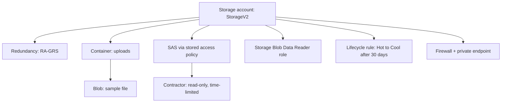

# 💾 Azure Storage: Redundancy, SAS & Lifecycle (AZ-104, portal-built)

This is the second lab in the set. Storage looks easy until the exam asks you to pick between five redundancy options and four ways to grant access, all of which sound similar. This lab teaches you those differences by building them.

The scenario: an app team needs a place to store user uploads. It has to survive a datacentre problem. An auditor needs to read a copy from another region. I have to give a contractor read-only access to one container for a day. And old files should get cheaper over time on their own.

## 🏗️ What I build here

## ✅ Before I started
- An Azure subscription where I am the Owner.
- A throwaway text file to upload.
- About 45 minutes.

## 📦 Phase 1 - Create the account and choose redundancy

### 💾 Create the storage account and understand redundancy
In the Azure portal, go to **Storage accounts > Create**. When you reach **Redundancy**, stop and read the options:

| Option | What it means |
|---|---|
| LRS | 3 copies in one datacentre. Cheapest. Survives a disk or rack failure. |
| ZRS | 3 copies across availability zones. Survives a whole zone going down, stays in-region. |
| GRS | LRS plus an async copy in a paired region. Survives a region outage (failover only). |
| GZRS | ZRS plus paired-region copy. Zone and region protection. |
| RA-GRS or RA-GZRS | Same as GRS or GZRS but you can read the secondary region now without failover. |

For this scenario I pick **RA-GRS**, because "an auditor needs to read a copy from another region" is what **RA-** means. Plain GRS only exposes the secondary after a failover.

**Screenshot:** `01-storage-account-redundancy.png`

## 📁 Phase 2 - Put something in it

### 📂 Create a container and upload a file
Create a container named `uploads` and upload your test file.
Open **Access keys** and look at the two keys there. These are full control over the whole account. This is why you do not hand them out. (Blur them in the screenshot.)

**Screenshot:** `02-containers-and-blobs.png`, `03-access-keys.png`

## 🔐 Phase 3 - The four ways to grant access

Each method has a different security model and use case.

### 🎫 Generate SAS tokens
On the blob, select **Generate SAS**. Set it to read-only and set the expiration to one hour. Copy the SAS URL and open it in a private browser tab. It works. Now you have delegated scoped, time-limited access without sharing a key.

**Screenshot:** `04-sas-token-config.png`, `05-sas-url-works.png`

### 🔑 Stored access policy and revocation
On the container, go to **Access policy > Add policy**. Create a new policy with read-only access. Now create a SAS that references this policy. Then delete the policy and refresh your SAS link. It no longer works. This is the only clean way to revoke a SAS before it expires, and the exam loves this question.

**Screenshot:** `06-stored-access-policy.png`, `07-sas-revoked.png`

**Important detail:** Stored access policy is the only way to revoke a SAS without waiting for it to expire. This is the production pattern. Inline SAS tokens cannot be revoked.

### 👤 RBAC data roles
On the storage account, go to **Access control (IAM)** and assign the **Storage Blob Data Reader** role to a user. This is identity-based and the most secure of the four methods. No secrets to leak.

**Screenshot:** `08-rbac-data-role.png`

### 📊 Understanding control plane vs data plane
There is a control plane (managing the account, RBAC roles like Owner or Contributor) and a data plane (reading the actual blobs, roles like Storage Blob Data Reader). Being Contributor on the account does not automatically let you read blob data unless the account allows key access or you also hold a data role. Feeling that gap is worth many marks on the exam.

## ♻️ Phase 4 - Lifecycle management

### 🔄 Set up lifecycle rules
Go to **Lifecycle management > Add rule**. Move blobs from Hot to Cool after 30 days, and maybe to Archive after 180 days.

**Important detail:** Archive is offline. You cannot read an archived blob directly. You have to rehydrate it first, which takes hours. So if your requirement says "needs instant read," Archive rules it out.

**Screenshot:** `09-lifecycle-rule.png`

## 🛡️ Phase 5 - Network security

### 🚪 Set up the firewall
Go to **Networking > Firewalls and virtual networks** and switch from **All networks** to **Selected networks**. This restricts the public endpoint to only your VNet or specific IP ranges.

**Screenshot:** `10-firewall-vnet.png`

### 🔒 Add a private endpoint
Add a **private endpoint** so the account is reachable on a private IP inside a VNet. This is different from a service endpoint.

**Screenshot:** `11-private-endpoint.png`

### 📍 Service endpoint vs private endpoint
The exam distinction here:
- A service endpoint keeps the public endpoint and just restricts it to your VNet. Free and cloud-only.
- A private endpoint gives the account an actual private IP via Private Link. Works from on-premises over VPN or ExpressRoute.

If the requirement says "private IP" or "reachable from on-premises," it is a private endpoint.

## 🧯 Break it and fix it
Set the firewall to **Selected networks** with no networks added. Then try to open your blob from the portal or via your SAS link. Access is denied. Now figure out whether to add your client IP, add a VNet, or flip "allow trusted Microsoft services." Fix it. Locking yourself out and getting back in teaches storage networking better than any lecture.

## 🎯 Key points this lab reinforces
- **RA-** prefix means read the secondary region without failover. **ZRS** means zone resilience in-region.
- Stored access policy is the clean way to revoke a SAS before it expires.
- Control-plane RBAC (Contributor) is not the same as data-plane access to blobs.
- Archive must be rehydrated before reading.
- Service endpoint (free, cloud-only) vs private endpoint (private IP, on-premises reach).
- Lifecycle rules reduce cost by moving old blobs to cheaper tiers automatically.

## 🏭 If this were production, not a lab
I would disable account-key access entirely and use RBAC plus private endpoint only. I would turn on soft delete and versioning. I would use customer-managed keys in Key Vault. Every SAS I issued would be tied to a stored access policy so I could pull it back if needed.

---
*Part of my AZ-104 hands-on set. Built in the portal. See `cli-reference/commands.md` for the same steps as `az` commands.*
