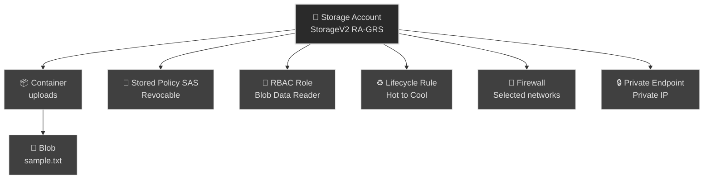
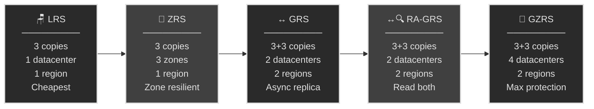
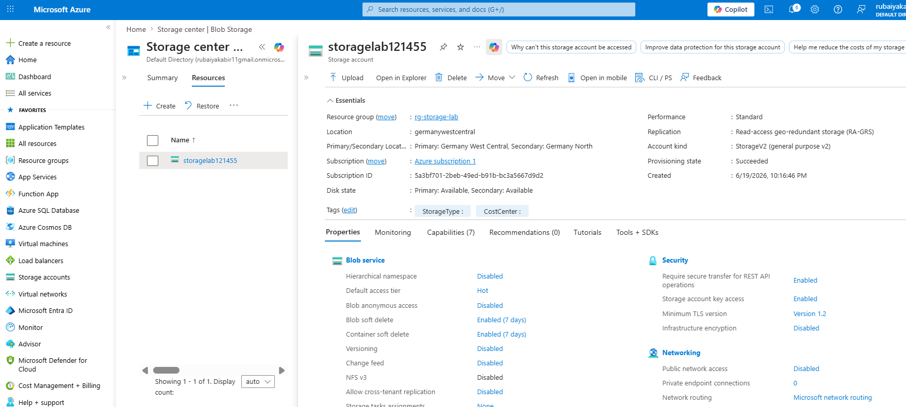
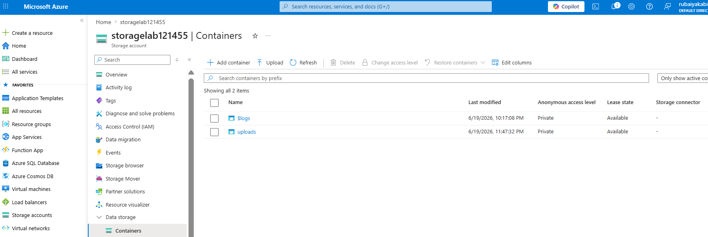
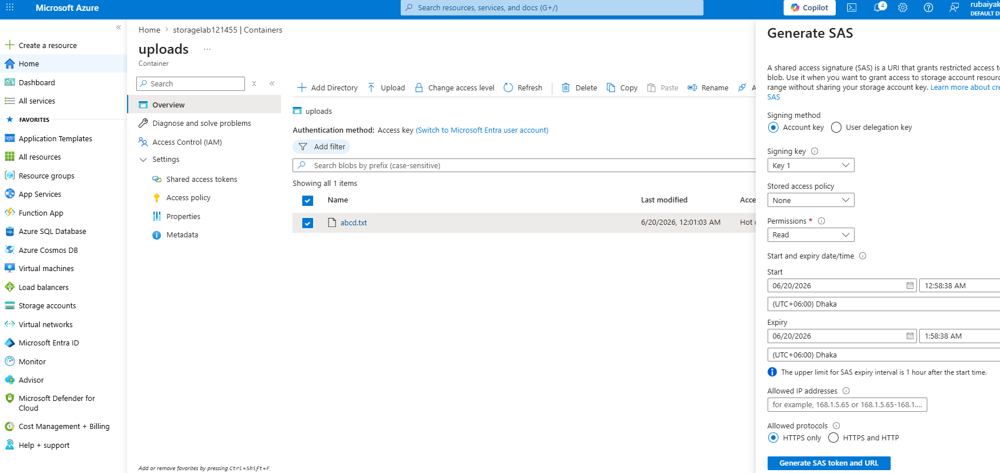
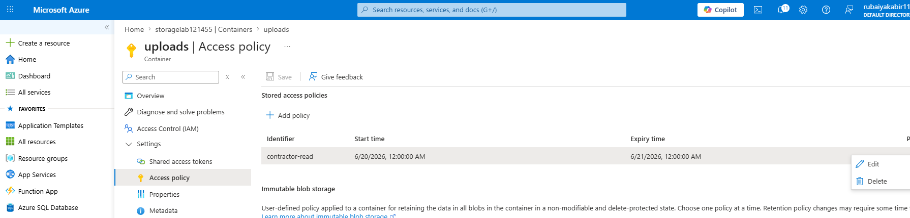
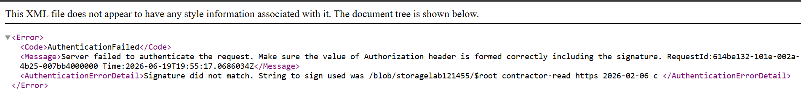
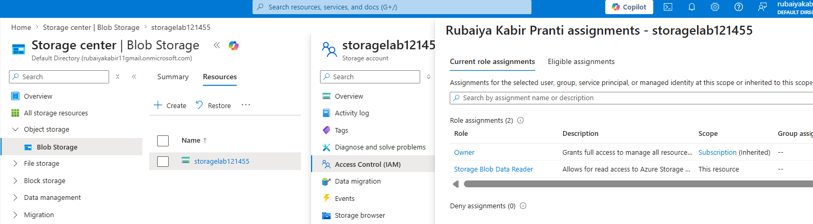
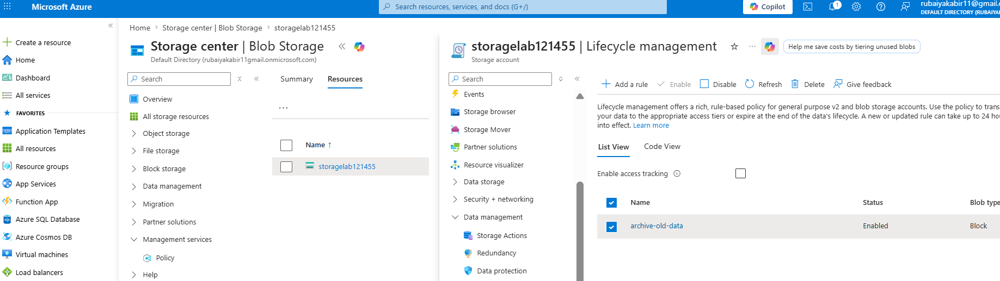
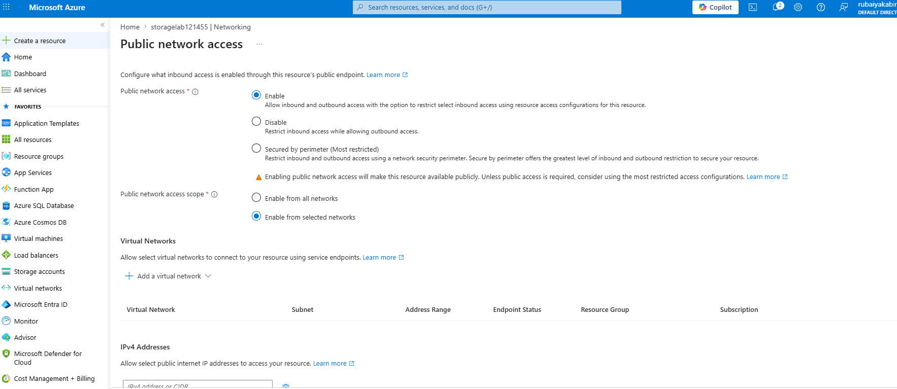

# 💾 Azure Storage: Redundancy, SAS, and Lifecycle (AZ-104, portal-built)

This is the second lab in my AZ-104 set. Storage appears simple at first. The AZ-104 exam tests understanding of five redundancy options and four ways to grant access. They all sound similar. This lab builds each one so I understand the differences.

**Exam status:** Not yet attempted. This lab builds practical storage security and resilience skills tested in AZ-104.

## 📋 The Scenario

**Fictional assignment:**
I have been handed a requirement to **secure and manage file storage** for an app team.

**Responsibilities:**

**✓ Files survive infrastructure failures**
- Choose redundancy that protects against datacentre or region outages
- Allow audit access from another region without failover

**✓ External users access files securely**
- Contractor needs read-only access to one container
- Access valid for exactly one day
- No permanent credentials to leak

**✓ Costs decrease automatically**
- Old files move to cheaper storage tiers
- No manual intervention required

**✓ Network stays private**
- Storage reachable only from authorized VNets
- Block all public internet access

**What I learn:**
- How to choose the right redundancy model
- The difference between four access methods (each with trade-offs)
- Lifecycle rules that cut costs on their own
- Network security patterns (firewall, private endpoint, service endpoint)

## 🏗️ What I build here

## 🧠 Storage Core Concepts

**Five redundancy patterns:**

**References:** [Azure Storage redundancy](https://learn.microsoft.com/en-us/azure/storage/common/storage-redundancy)

**Understanding each option:**

- **LRS (Locally Redundant Storage):** Three copies in one datacenter. Protects against disk or server failure. Cheapest option. Use for dev/test or data I can lose.

- **ZRS (Zone Redundant Storage):** Three copies spread across three availability zones in the same region. If an entire zone goes down, data survives. Costs more than LRS but keeps data in the same region. Use for critical data that stays in-region.

- **GRS (Geo-Redundant Storage):** Copies to a paired region automatically, but asynchronously. I can only read the secondary copy **after a failover** (disaster). If region goes down, I trigger failover manually (hours of downtime).

- **GZRS (Geo-Zone-Redundant Storage):** Zone resilience inside one region (like ZRS) PLUS a paired-region copy. Maximum protection but most expensive. Use only for mission-critical data.

- **RA-GRS (Read-Access GRS):** Same as GRS plus I can read the secondary copy **right now** without any failover. Perfect when an auditor or backup system needs to read a live copy from another region. This is the lab choice.

- **RA-GZRS:** Zone resilience inside one region PLUS a readable paired-region copy. Maximum protection and read access to secondary without failover.

## ✅ Before I started

- An Azure subscription where I am the Owner
- A small test file to upload
- About 45 minutes

## 📦 Prerequisite - Create resource group and storage policies

### 📂 Create a new resource group for storage

**Steps:**
1. In the portal, search for **Resource groups**
2. Select **Create**
3. Set **Subscription** to my subscription
4. Set **Resource group name** to `rg-storage-lab`
5. Set **Region** to my chosen region (this matters for policy enforcement)
6. Select **Review + create** > **Create**

**Why a separate resource group:**
- Keeps storage lab isolated from identity lab (project 01)
- Allows storage-specific policies without affecting other resources
- Each lab scenario stands independently

### 🛡️ Create storage-specific Azure Policies

Storage policies enforce compliance rules. I create policies similar to project 01 but tailored for storage resources.

**Policy 1: Restrict allowed locations for storage**

**Steps:**
1. Search for **Policy** and open it
2. Select **Assignments** > **Assign policy**
3. Set **Scope** to `rg-storage-lab`
4. Next to **Policy definition**, select browse button
5. Search for **Allowed locations** and select the built-in definition
6. On **Parameters** tab: set allowed location to my single region (same as resource group region)
7. Select **Review + create** > **Create**

**What this does:**
- Storage accounts can only be created in the region I specify
- Attempts to create in other regions fail at validation

**Policy 2: Require a storage-specific tag**

**Steps:**
1. Select **Assign policy** again
2. Set **Scope** to `rg-storage-lab`
3. For **Policy definition**: search for and select built-in **Require a tag on resources**
4. On **Parameters** tab: set tag name to `StorageType`
5. Select **Review + create** > **Create**

**Important note about tagging:**
- You need **both** `StorageType` tag (for this lab) **AND** `cost center` tag (from project 01 policy)
- If a resource is missing either tag, the policy will block creation
- Assign both tags when creating the storage account

**What this does:**
- Every resource in `rg-storage-lab` must have a `StorageType` tag
- Resources without the tag cannot be created
- Examples: `StorageType: production`, `StorageType: backup`, `StorageType: archive`

**Policy 3: Deny storage accounts without encryption at rest**

**Steps:**
1. Select **Assign policy** again
2. Set **Scope** to `rg-storage-lab`
3. For **Policy definition**: search for **Secure transfer to storage accounts should be enabled**
4. Select **Review + create** > **Create**

**What this does:**
- Forces storage accounts to use secure (HTTPS) connections
- Blocks insecure configurations

## 📦 Phase 1 - Create the account and choose redundancy

### 💾 Create the storage account

**Steps:**
1. In the portal, search for **Storage accounts**
2. Select **Create**
3. Fill in basics: subscription, resource group, storage account name

**Account name rules:**
- Must be globally unique (I may not find my preferred name)
- Lowercase letters and numbers only
- 3 to 24 characters

### 🔄 Choose the redundancy option

**Five redundancy options:**

| Redundancy Type | Primary Region Datacenters | Secondary Region Datacenters | Total Copies Maintained |
|---|---|---|---|
| **LRS** (Locally Redundant Storage) | 1 datacenter | 0 (No replication) | 3 total copies (all in one building) |
| **ZRS** (Zone-Redundant Storage) | 3 separate datacenters | 0 (No replication) | 3 total copies (1 per datacenter) |
| **GRS** (Geo-Redundant Storage) | 1 datacenter | 1 datacenter | 6 total copies (LRS primary + LRS secondary) |
| **GZRS** (Geo-Zone-Redundant Storage) | 3 separate datacenters | 1 datacenter | 6 total copies (ZRS primary + LRS secondary) |
| **RA-GRS** (Read-Access GRS) | 1 datacenter | 1 datacenter | 6 total copies (readable without failover) |
| **RA-GZRS** (Read-Access GZRS) | 3 separate datacenters | 1 datacenter | 6 total copies (readable without failover) |

**When to use each option:**

| Option | When to use |
|--------|-----------|
| **LRS** | Dev/test, non-critical data, lowest cost, can tolerate datacenter loss |
| **ZRS** | Needs zone resilience within one region, critical data that stays in-region |
| **GRS** | Needs region failover protection, can read secondary only after failover |
| **GZRS** | Maximum protection within region plus paired region backup, most expensive |
| **RA-GRS** | Auditor needs live secondary copy without failover, need readable backup in paired region |
| **RA-GZRS** | Maximum protection with readable secondary region, zone resilience primary plus readable backup |

**For this lab:**
I select **RA-GRS** because:
- The auditor needs to read a copy from another region **today**, not after a disaster
- The **RA-** prefix allows reading the secondary copy without a failover
- Plain GRS would hide the secondary copy until disaster strikes
- Hot tier (already set) ensures blobs are readable immediately in both the primary and secondary region
- Soft delete (already enabled) recovers accidental deletes before you realize they are gone

*Choosing RA-GRS during storage account creation.*

**Advanced settings during creation:**

On the **Advanced** tab, configure:

**Soft delete for blobs:**
- Set to **Enabled**
- Days to retain: **7 days** (standard recovery window for labs)
- Soft delete helps recover accidentally deleted blobs without administrator intervention

**Public access level:**
- Set to **Disabled**
- Prevents anonymous access to blobs
- Access is controlled via SAS, RBAC, or stored policies (taught later in this lab)

**Access tier:**
- Select **Hot**
- Hot tier means blobs are immediately available (no rehydration delay)
- For this lab, Hot is appropriate (you read blobs immediately)
- Cool and Archive tiers are managed by lifecycle rules (Phase 3), not at creation time

**Minimum TLS version:**
- Set to **TLS 1.2** or higher
- Required for the "Secure transfer" policy to validate correctly

### 📁 Create a container and upload a file

**Steps:**
1. After account creation, open the storage account
2. Select **Containers** from the left menu
3. Select **+ Container**
4. Name it `uploads`
5. Upload a test file into the container

**What I see:**
- The container is the storage **level below** the account
- Blobs (files) live inside containers
- Each container has its own access settings

## 🔐 Phase 2 - Four ways to grant access

Storage offers four access methods. Each has different security properties, and I need to know the trade-offs for the AZ-104 exam.

### 1️⃣ Account keys (full control)

**How it works:**
1. Open the storage account
2. Select **Access keys** from the left menu
3. Two keys appear. Each gives **full control** over the entire account

**Why I do not use this for external access:**
- No scoping (keys unlock **everything**)
- No time limit (key works forever)
- If leaked, I have no way to revoke it except rotating all keys (affects all users)

**When I use account keys:**
- Development and testing on my own machine
- Applications that need permanent access and run in a locked environment

**Screenshot note:** I always blur account keys in screenshots. They are credentials.

*Container and blob structure.*

### 2️⃣ SAS token (Shared Access Signature)

**Generate an ad-hoc SAS token:**
1. Select a blob or container
2. Select **Generate SAS**
3. Set **Permissions** to read-only
4. Set **Expiry** to one hour
5. Copy the **SAS URL**
6. Open the URL in a private browser tab - it works

**Why this is useful:**
- Scoped to a specific blob or container
- Time-limited (expires in one hour)
- Read-only (cannot write or delete)

**The problem with ad-hoc SAS:**
- Cannot revoke it before expiry - it works until the timer runs out
- If leaked, I am stuck waiting for it to expire

**Used for:**
- Contractor downloads a specific file for a few hours
- Sharing a temporary download link

**→ Troubleshooting:** See [Issues.md](Issues.md) for detailed troubleshooting guide covering authentication errors, role assignment, and SAS token generation issues.

### 3️⃣ Stored access policy (revocable SAS)

**Create a stored access policy:**
1. On the container, select **Access policy**
2. Select **+ Add policy**
3. Name: `contractor-read`
4. Permissions: read-only
5. Expiry: tomorrow

**Generate a SAS from this policy:**
1. Select **Generate SAS**
2. Link it to the policy I created
3. Copy the SAS URL

**Now I can revoke it:**
1. Delete the policy
2. Refresh the SAS URL - **it no longer works**

**Why this is production-safe:**
- SAS tied to a policy can be revoked instantly
- Ad-hoc SAS cannot be revoked at all

**Comparison on the exam:**
- A likely AZ-104 question: "How do I revoke a SAS that is already issued?"
- Answer: Use a stored access policy. Ad-hoc SAS cannot be revoked.

**→ Troubleshooting:** See [Issues.md - Issue 6: Stored access policy SAS requires blob-level generation](Issues.md#issue-6-stored-access-policy-sas-requires-blob-level-generation) for detailed walkthrough of the correct process and why blob-level generation is required.

*A stored access policy on the uploads container.*

*After deleting the policy, the SAS stops working immediately.*

### 4️⃣ RBAC data roles (identity-based, most secure)

**Assign Storage Blob Data Reader role:**
1. Open the storage account
2. Select **Access control (IAM)**
3. Select **+ Add** - **Add role assignment**
4. Role: **Storage Blob Data Reader**
5. Assign to: the user or group
6. The user can now read blobs - no secrets needed

**Why this is the most secure:**
- No credential to leak (uses Azure AD sign-in)
- Can be revoked instantly by removing the role
- Auditable (who accessed what, when)
- Can use conditional access policies

**Data-plane vs control-plane:**
- Control-plane: managing the account (Owner, Contributor, Reader)
- Data-plane: reading blob data (Storage Blob Data Reader, Storage Blob Data Contributor)

**Common mistake:**
- Making someone Owner (myself)/ Contributor on the account does **not** give them blob read access
- They need a **data-plane role** (Blob Data Reader) to actually read blobs

**Storage RBAC roles:**
- **Storage Blob Data Reader** - read blobs, list containers
- **Storage Blob Data Contributor** - read, write, delete blobs
- **Storage Blob Data Owner** - full control plus manage permissions
- **Storage Queue Data Reader** - read queue messages
- **Storage Queue Data Contributor** - read and send messages

*Storage Blob Data Reader role assigned to a user/me.*

## 📊 When to use each method

| Method | Scope | Expiry | Revocable | Use case |
|--------|-------|--------|-----------|----------|
| Account key | Entire account | Never | Complex | Dev/test only |
| Ad-hoc SAS | Blob or container | Time-based | No | Temporary shares <1 day |
| Stored policy SAS | Blob or container | Time-based | Yes | Contractors, partners |
| RBAC role | Storage account (recommended) or resource group | Role removal | Yes | Employees, services (most secure) |

## 🔐 Deep dive: Access control confusion points

**Why is data-plane RBAC different from control-plane RBAC?**

- **Control-plane:** managing the storage account itself (create, delete, change settings)
  - Roles: Owner, Contributor, Reader, Storage Account Contributor
  - Where: "Access control (IAM)" on the storage account
  - Gives you the **right to configure** storage

- **Data-plane:** reading and writing actual blob data
  - Roles: Storage Blob Data Reader, Storage Blob Data Contributor, Storage Blob Data Owner
  - Where: "Access control (IAM)" on the storage account (different tab)
  - Gives you the **right to access** the data

**Common mistake:**
I have Contributor role on storage account. This means I can:
- ✓ Delete containers
- ✓ Change settings
- ✗ Read blob data (without a data-plane role)

To read blobs, I need **both**:
- Contributor (control-plane) OR Storage Account Contributor
- **AND** Storage Blob Data Reader (data-plane)

**Example from the lab:**
- The auditor might have no control-plane role at all
- But they need Storage Blob Data Reader (data-plane role)
- Now they can only read blobs - cannot change settings or delete containers

**Reference:** [Azure storage security overview](https://learn.microsoft.com/en-us/azure/storage/common/storage-security-guide)

---

**Why can I revoke a stored policy SAS but not ad-hoc SAS?**

**Ad-hoc SAS:**
- I generate it directly on a blob or container
- The SAS token **contains the signature** (permission + expiry + signature hash)
- Azure cannot revoke it because the signature is valid until expiry time
- The only way to "revoke" it is to wait for expiry

**Stored policy SAS:**
- I create a policy on the container (named access policy)
- I generate SAS that **references the policy** (not a direct signature)
- When I delete the policy, the SAS URL returns 403 Forbidden immediately
- This is production-safe

**Why this matters for the exam:**
- Likely question: "A contractor received a SAS link yesterday. I want to revoke it today. What do I do?"
- Answer: Use a stored access policy. I cannot revoke ad-hoc SAS tokens.

**Reference:** [Stored access policies](https://learn.microsoft.com/en-us/rest/api/storageservices/define-stored-access-policy)

---

**Why is Archive tier offline, and when does that matter?**

**The Archive tier:**
- Data is stored in a secondary, cheaper tier
- Access time is measured in hours (1-15 hours depending on priority)
- You must **rehydrate** it first - copy data back to Hot or Cool tier
- Only after rehydration can you read it

**When Archive breaks requirements:**
- Requirement: "Users need instant access to archived data"
- Archive is **ruled out** (no instant access)
- Use Hot or Cool tier instead

**Cost tradeoff:**
- Archive costs ~87% less per GB than Hot
- But rehydration costs extra and takes time
- Use only for data you rarely access (compliance archives, 7-year retention)

**Example from the lab:**
- Blobs in Hot tier for first 30 days (active use)
- Move to Cool tier at 30 days (occasional access)
- Move to Archive at 180 days (long-term retention)

**Reference:** [Azure Blob Storage lifecycle](https://learn.microsoft.com/en-us/azure/storage/blobs/access-tiers-overview)

## ♻️ Phase 3 - Lifecycle management

Lifecycle rules automatically move blobs to cheaper tiers as they age. This cuts costs without manual intervention.

### 🔄 Create a lifecycle rule

**Steps:**
1. Open the storage account
2. Select **Lifecycle management** from the left menu
3. Select **+ Add rule**
4. Give the rule a name: `archive-old-data`
5. Set **If** to "Blobs modified more than 7 days ago"
6. Set **Then** to "Move to Cool storage"
7. Save the rule

**What happens:**
- All blobs older than 7 days automatically move to Cool tier
- This happens every night - I do not manage it

### 💰 The storage tiers and costs

| Tier | Access time | Cost | Minimum hold | Use case |
|------|-------------|------|--------------|----------|
| **Hot** | Immediate | Most expensive (~$0.016/GB/month) | None | Frequent access (active data) |
| **Cool** | Immediate (no rehydration) | Cheaper (~$0.008/GB/month, 50% less) | 30 days | Infrequent access (backups, archives) |
| **Cold** | Immediate (no rehydration) | Mid-tier (~$0.004/GB/month, 75% less) | 90 days | Rarely accessed (long-term archives) |
| **Archive** | Offline, rehydration 1-15 hours | Cheapest (~$0.002/GB/month, 87% less) | 180 days | Long-term retention (compliance, 7-year holds) |

**Important detail about Archive:**

Archive is **offline storage**. You cannot read data directly:

1. **Blob is archived** - stored on cheap media
2. **You need to read it** - request rehydration
3. **Rehydration starts** - data copies back to Hot or Cool (takes 1-15 hours)
4. **Now you can read it** - blob is accessible

**When Archive is ruled out:**
- Requirement says "users need instant read access"
- Requirement says "RTO must be under 1 hour"
- Use Hot or Cool tier instead

**When Archive is the right choice:**
- Compliance requirement to keep data 7 years
- Rarely accessed (maybe once a year for audit)
- Cost savings are massive (87% cheaper)
- Save thousands of dollars per year

**Exam pattern I need to know:**
- Likely question: "We need to read archived data in under 1 hour. Which tier?"
- Answer: Cool tier (instant read). Archive requires rehydration (hours).

**Reference:** [Azure Blob Storage access tiers](https://learn.microsoft.com/en-us/azure/storage/blobs/access-tiers-overview)

---

**What does "30-day minimum hold" mean for Cool tier?**

- If I move a blob to Cool tier, I must keep it there for at least 30 days
- If I move it back to Hot tier before 30 days, I pay an **early deletion fee**
- Early deletion fee: roughly 30 days of Cool tier storage cost
- After 30 days, no penalty

**When this matters:**
- Do not use Cool tier for data you might need to move back quickly
- Use Cool for backups and archives (long-term, stable)
- Use Hot for active working data

**Cost example:**
- Blob: 100 GB
- Move to Cool, then back to Hot after 10 days
- Penalty: ~20 days of Cool storage cost (~$0.16)
- This is why lifecycle rules should have a 30-day minimum

*A lifecycle rule that moves blobs from Hot to Cool after 30 days.*

## 🛡️ Phase 4 - Network security

Storage accounts are public by default - anyone on the internet can reach them (though they need credentials to read data). Network security restricts access to trusted networks only.

### 🚪 Set up a firewall

**Steps:**
1. Open the storage account
2. Select **Networking** from the left menu
3. Select **Firewalls and virtual networks** tab
4. Change **Default action** from "Allow" to "Deny"
5. Add exceptions:
   - Add my current client IP (for admin access)
   - Add my VNet (for application servers)

**What this does:**
- Blocks the public endpoint from the internet
- Allows only specific IPs and VNets to reach the account

**Result:**
- My office IP: can access ✓
- A contractor's IP: blocked ✗
- Application servers in my VNet: can access ✓
- Random internet user: blocked ✗

09-firewall-vnet-02.png

*The firewall set to deny by default, then add specific virtual networks.*

### 🔒 Add a private endpoint

Private endpoints give the storage account a **private IP** inside a VNet. This is different from restricting the public endpoint.

**Steps:**
1. Select **Private endpoints** from the left menu
2. Select **+ Create private endpoint**
3. Set scope to subscription and resource group
4. Set **Name** to `storage-pe`
5. Select **Resource: storage account**
6. Set **Target sub-resource** to `blob`
7. Set **Virtual network** to my VNet
8. Set **Subnet** to my chosen subnet
9. Review and create

**What I get:**
- Storage account accessible at a private IP (e.g., 10.0.1.5) inside my VNet
- The public endpoint still exists but is firewalled
- Applications in my VNet reach storage via the private IP

*A private endpoint gives the account a private IP inside a VNet.*

### 📍 Service endpoint vs private endpoint

These are often confused on the exam. Here is the **key difference**:

| Feature | Service Endpoint | Private Endpoint |
|---------|------------------|------------------|
| Cost | Free | Charged (small hourly fee, ~$0.007/hour) |
| IP type | Public (restricted) | Private (new IP) |
| VPN/ExpressRoute | No | Yes |
| On-premises access | No | Yes (over VPN or ExpressRoute) |
| Requires DNS changes | No | Yes (storage.blob.core.windows.net → private IP) |
| Configuration complexity | Simple (one toggle) | Complex (subnet, DNS, network setup) |

**Service Endpoint explained:**
- Public endpoint still exists
- I just restrict it to my VNet (firewall rule that says "only from this VNet")
- Anyone outside my VNet cannot reach it (even if they have a valid SAS token)
- Free
- Cloud-only (cannot reach from on-premises)

**When to use service endpoint:**
- I have a VNet with application servers
- I want to restrict storage to that VNet only
- I do not need on-premises access
- I want to save money (free)

**Private Endpoint explained:**
- Storage account gets a **new private IP** (e.g., 10.0.1.5) inside my VNet
- Public endpoint still exists but is firewalled
- Applications in my VNet connect to the private IP (not the public IP)
- Applications on-premises can reach it over VPN or ExpressRoute
- Requires DNS updates so storage.blob.core.windows.net resolves to the private IP

**When to use private endpoint:**
- I have on-premises servers that need to access storage
- I need a private IP inside my VNet
- I can afford the hourly charge
- I can manage DNS updates

**Exam pattern I need to know:**
- Likely question: "How do I allow on-premises servers to access storage?"
- Answer: Private endpoint (on-premises cannot reach service endpoint)

**Reference:** [Service endpoints vs Private Link](https://learn.microsoft.com/en-us/azure/storage/common/storage-private-endpoints-overview)

---

**Why does the firewall block me from the portal?**

- The Azure portal and Azure CLI are Microsoft services
- When I set firewall to "Deny all", it blocks **everything** - including Microsoft services
- The portal needs a "trusted services" exception
- Solution: Check "Allow trusted Microsoft services and system services"
- Now the portal can reach storage even when firewall is restrictive

**Other trusted services that can bypass firewall:**
- Azure Backup
- Azure Site Recovery
- Azure Monitor
- Azure Synapse
- Some others

**Exam pattern I need to know:**
- Likely question: "I set storage firewall to deny all networks. Now the portal cannot access it. How do I fix?"
- Answer: Enable "Allow trusted Microsoft services and system services"

## 🧯 Break it and fix it

**Scenario:**
I set the firewall to **Deny** by default. I add no exceptions. Then I attempt to:
1. Access my blob from the portal
2. Access my blob through a SAS URL

Both fail.

**Debug and fix:**
- Read the error messages (they tell me the firewall is blocking)
- Options to fix:
  - Add my client IP to the firewall
  - Add my client IP range
  - Add "Allow trusted Microsoft services" (portal is a Microsoft service)
- Pick the right option and test again

**Why this matters:**
- Firewall misconfiguration is a real production issue
- I learn the error messages and how to read them
- I understand that "Allow trusted services" lets Azure portal and Azure CLI through

## 🎯 Key points this lab reinforces

**Redundancy (memorize these):**
- **LRS** = one datacenter, cheapest
- **ZRS** = zone resilient (same region), protects zone failures
- **GRS** = region failover (read only after disaster)
- **RA-GRS** = read secondary region now (auditor use case)
- **RA-** prefix = readable copy without failover

**Access methods (know the trade-offs):**
- Account key: unlimited scope, no expiry, cannot revoke - avoid for external users
- Ad-hoc SAS: scoped, time-limited, cannot revoke - contractor for a few hours
- Stored policy SAS: scoped, time-limited, revocable - contractor, partners
- RBAC role: identity-based, no secret, revocable immediately - employees, services (most secure)

**Lifecycle tiers:**
- Archive is offline - must rehydrate before read (takes hours)
- "Needs instant read" rules out Archive
- Lifecycle rules run automatically, no manual intervention needed

**Network security:**
- Firewall restricts public endpoint (free, cloud-only)
- Private endpoint creates private IP (paid, reaches on-premises)
- Service endpoint: keep public IP, restrict to VNet (free)
- Private endpoint: new private IP through Private Link (paid, on-premises capable)

**Important concepts for the AZ-104 exam:**
- Confusing "can read data" with "can manage account" (data-plane vs control-plane RBAC)
- Thinking ad-hoc SAS can be revoked (it cannot - use stored policy)
- Thinking Archive tier allows instant reads (it does not - rehydration required)
- Thinking service endpoint and private endpoint are the same (they are not)

## 🏭 If this were production, not a lab

**What I would do differently:**

**Access:**
- Disable account key access entirely (set to "Denied")
- Use RBAC roles for all applications and users
- Every SAS token would be tied to a stored access policy (for revocation)

**Resilience:**
- Use RA-GZRS (zones plus readable paired region) for critical data
- Enable blob versioning (recover from accidental deletes)
- Enable soft delete (60-day recovery window)

**Security:**
- Private endpoint for all access (firewall blocks public IP completely)
- Customer-managed encryption keys in Key Vault
- Enable immutable blobs for compliance (cannot delete until expiry)

**Monitoring:**
- Log all access via Azure Monitor and Log Analytics
- Alert on failed authentication attempts
- Regular access reviews to remove stale permissions

**Note:**
Most of these practices are beyond AZ-104 scope. But they shape the real-world patterns.

---
*Part of my AZ-104 hands-on set. Built in the portal. See `cli-reference/commands.md` for the same steps as `az` commands.*