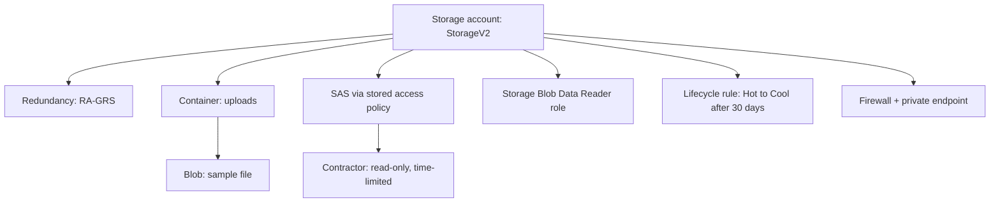

# 💾 Azure Storage: Redundancy, SAS, and Lifecycle (AZ-104, portal-built)

This is the second lab in the set. Storage looks simple at first. Then the exam asks me to choose between five redundancy options and four ways to grant access. They all sound alike. This lab shows me the differences by building each one.

**The scenario:** an app team needs somewhere to store user uploads.

The needs are:
- The files must survive a datacentre problem.
- An auditor must be able to read a copy from another region.
- A contractor needs read-only access to one container, for one day.
- Old files should get cheaper over time, on their own.

## 🏗️ What I build here

## ✅ Before I started
- An Azure subscription where I am the Owner.
- A throwaway text file to upload.
- About 45 minutes.

## 📦 Phase 1 - Create the account and choose redundancy

### 💾 Create the storage account and understand redundancy
1. In the portal, go to **Storage accounts**, then **Create**.
2. Fill in the basics. When I reach **Redundancy**, I stop and read the options.

| Option | What it means |
|---|---|
| LRS | 3 copies in one datacentre. Cheapest. Survives a disk or rack failure. |
| ZRS | 3 copies across availability zones. Survives a whole zone going down. Stays in-region. |
| GRS | LRS plus an async copy in a paired region. Survives a region outage, but only after a failover. |
| GZRS | ZRS plus a paired-region copy. Zone and region protection. |
| RA-GRS or RA-GZRS | Same as GRS or GZRS, but I can read the secondary region now, without a failover. |

For this scenario I pick **RA-GRS**. The auditor needs to read a copy from another region. The **RA-** prefix is what allows that. Plain GRS opens the secondary copy only after a failover.

*Choosing RA-GRS while creating the storage account.*

## 📁 Phase 2 - Put something in it

### 📂 Create a container and upload a file
1. Create a container named `uploads`.
2. Upload my test file into it.
3. Open **Access keys** and look at the two keys. Each key is full control over the whole account. That is why I do not share them. I blur them in the screenshot.

*The uploads container with my test file inside.*

*The two account keys. They give full control, so I keep them secret.*

## 🔐 Phase 3 - The four ways to grant access

There are four ways to grant access. Each one has a different security model and use case.

### 🎫 Generate a SAS token
1. On the blob, select **Generate SAS**.
2. Set it to read-only. Set the expiry to one hour.
3. Copy the SAS URL. Open it in a private browser tab. It works.

This gives scoped, time-limited access without sharing a key.

*A read-only SAS token, set to expire in one hour.*

*The SAS URL opens the file in a private tab. The access works.*

### 🔑 Stored access policy and revocation
1. On the container, go to **Access policy**, then **Add policy**.
2. Create a policy with read-only access.
3. Create a new SAS that points to this policy.
4. Delete the policy. Refresh the SAS link. It no longer works.

**Important detail:** A stored access policy is the only clean way to revoke a SAS before it expires. This is the production pattern. An inline SAS token cannot be revoked. It only stops when it expires. The exam asks about this often.

*A stored access policy on the uploads container.*

*After I delete the policy, the SAS link stops working.*

### 👤 RBAC data roles
1. On the storage account, go to **Access control (IAM)**.
2. Assign the **Storage Blob Data Reader** role to a user.

This is identity-based. It is the most secure of the four methods. There are no secrets to leak.

*The Storage Blob Data Reader role assigned to a user.*

### 📊 Control plane vs data plane
There are two planes:
- The **control plane** manages the account. Roles like Owner and Contributor live here.
- The **data plane** reads the actual blobs. Roles like Storage Blob Data Reader live here.

Being Contributor on the account does not let me read blob data on its own. I also need a data role, or the account must allow key access. This gap is worth remembering for the exam.

## ♻️ Phase 4 - Lifecycle management

### 🔄 Set up a lifecycle rule
1. Go to **Lifecycle management**, then **Add rule**.
2. Move blobs from Hot to Cool after 30 days.
3. Optionally, move them to Archive after 180 days.

**Important detail:** Archive is offline. I cannot read an archived blob directly. I have to rehydrate it first, and that takes hours. So if a requirement says "needs instant read", Archive is ruled out.

*A lifecycle rule that moves blobs from Hot to Cool after 30 days.*

## 🛡️ Phase 5 - Network security

### 🚪 Set up the firewall
1. Go to **Networking**, then **Firewalls and virtual networks**.
2. Switch from **All networks** to **Selected networks**.

This limits the public endpoint to my VNet, or to specific IP ranges.

*The firewall set to selected networks only.*

### 🔒 Add a private endpoint
1. Add a **private endpoint** to the account.

Now the account is reachable on a private IP inside a VNet. This is not the same as a service endpoint.

*A private endpoint gives the account a private IP inside a VNet.*

### 📍 Service endpoint vs private endpoint
- A **service endpoint** keeps the public endpoint. It just restricts it to my VNet. It is free and cloud-only.
- A **private endpoint** gives the account a real private IP through Private Link. It works from on-premises over VPN or ExpressRoute.

If the requirement says "private IP" or "reachable from on-premises", the answer is a private endpoint.

## 🧯 Break it and fix it
I set the firewall to **Selected networks**, but I add no networks. Then I try to open my blob, from the portal and through my SAS link. Access is denied. Now I work out the fix. The options are: add my client IP, add a VNet, or allow trusted Microsoft services. I pick the right one and get back in. Locking myself out and getting back in teaches storage networking better than any lecture.

## 🎯 Key points this lab reinforces
- The **RA-** prefix means I can read the secondary region without a failover. **ZRS** means zone resilience inside one region.
- A stored access policy is the clean way to revoke a SAS early.
- Control-plane RBAC (Contributor) is not the same as data-plane access to blobs.
- An archived blob must be rehydrated before I can read it.
- Service endpoint: free, cloud-only. Private endpoint: private IP, reaches on-premises.
- Lifecycle rules cut cost by moving old blobs to cheaper tiers on their own.

## 🏭 If this were production, not a lab
I would turn off account-key access and use RBAC plus a private endpoint only. I would turn on soft delete and versioning. I would use customer-managed keys in Key Vault. Every SAS I issued would be tied to a stored access policy, so I could pull it back when needed.

---
*Part of my AZ-104 hands-on set. Built in the portal. See `cli-reference/commands.md` for the same steps as `az` commands.*