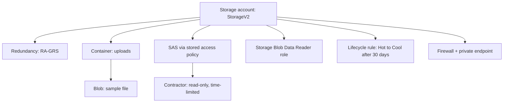

# Secure Azure Storage: RBAC, SAS & Lifecycle (AZ-104, portal-built)

Second lab in the set. Storage looks easy until the exam asks you to pick between five redundancy options and four ways to grant access, all of which sound similar. So this lab is built to make me *feel* those differences instead of memorising a table.

The scenario: an app team needs somewhere to keep user uploads. It has to survive a datacentre problem, an auditor needs to read a copy from another region, I have to hand a contractor read-only access to one container for a day, and old files should get cheaper over time on their own.

## What I build here

## Before you start
- An Azure subscription.
- A throwaway text file to upload.

## Phase 1 - Create the account, and actually choose redundancy
**Storage accounts > Create.** When you reach **Redundancy**, stop and read the options instead of clicking through:

| Option | What it really gives you |
|---|---|
| LRS | 3 copies in one datacentre. Cheapest. Survives a disk/rack failure. |
| ZRS | 3 copies across availability zones. Survives a whole zone going down, stays in-region. |
| GRS | LRS + an async copy in a paired region. Survives a region outage (failover only). |
| GZRS | ZRS + paired-region copy. Zone *and* region protection. |
| RA-GRS / RA-GZRS | Same as GRS/GZRS but you can **read** the secondary region right now. |

For this scenario I pick **RA-GRS**, because "an auditor needs to read a copy from another region" is the literal definition of the **RA-** prefix. Plain GRS only exposes the secondary after a failover. Write your reasoning in the commit - that reasoning *is* the exam skill.

> Screenshot: `01-storage-account-redundancy.png`

## Phase 2 - Put something in it
Create a container `uploads`, upload your file. Look at **Access keys** - there are two, and they are full control over the whole account. That is exactly why you do not hand them out. (Blur them in the screenshot.)

> Screenshot: `02-containers-and-blobs.png`, `03-access-keys.png`

## Phase 3 - The four ways to grant access (the heart of the lab)
1. **SAS token.** On the blob, **Generate SAS** - read-only, expires in an hour. Open the URL in a private browser tab; it works. Now you have delegated *scoped, time-limited* access without sharing a key.
2. **Stored access policy.** On the container, **Access policy > Add policy**. Create a SAS that *references* this policy. Then delete the policy and refresh your SAS link - it dies. This is the only clean way to **revoke** a SAS before it expires, and it is a favourite exam question.
3. **RBAC data role.** On the account, **Access control (IAM)**, assign **Storage Blob Data Reader** to a user. This is identity-based and the most secure of the four - no secrets to leak.
4. (Account keys you already saw - all-or-nothing, rotate them, do not share them.)

> Screenshot: `04-sas-token-config.png`, `05-sas-url-works.png`, `06-stored-access-policy.png`, `07-sas-revoked.png`, `08-rbac-data-role.png`

Subtlety the exam checks: there is a **control plane** (managing the account - RBAC roles like Owner/Contributor) and a **data plane** (reading the actual blobs - roles like *Storage Blob Data Reader*). Being Contributor on the account does **not** automatically let you read blob data unless the account allows key access or you also hold a data role. Feeling that gap is worth a lot of marks.

## Phase 4 - Make old files cheaper on their own
**Lifecycle management > Add rule.** Move blobs from Hot to Cool after 30 days, maybe to Archive after 180. Note that **Archive is offline** - you cannot read an archived blob directly, you have to **rehydrate** it first (hours). So "needs instant read" rules Archive out.

> Screenshot: `09-lifecycle-rule.png`

## Phase 5 - Lock the front door
1. **Networking > Firewalls and virtual networks**, switch to **Selected networks**.
2. Add a **private endpoint** so the account is reachable on a private IP inside a VNet.

The exam distinction here: a **service endpoint** keeps the public endpoint and just restricts it to your VNet (free, cloud-only). A **private endpoint** gives the account an actual private IP via Private Link, and that is the one that also works from on-premises over VPN/ExpressRoute. If the requirement says "private IP" or "reachable from on-prem," it is a private endpoint.

> Screenshot: `10-firewall-vnet.png`, `11-private-endpoint.png`

## Break it and fix it
Set the firewall to **Selected networks** with no networks added, then try to open your blob from the portal or your SAS link. Access denied. Now figure out whether to add your client IP, add a VNet, or flip "allow trusted Microsoft services" - and fix it. Locking yourself out and getting back in teaches storage networking better than any slide.

## The exam traps baked into this lab
- **RA-** prefix = read the secondary region without a failover; ZRS = zone resilience in-region.
- Stored access policy = the clean way to revoke a SAS.
- Control-plane RBAC (Contributor) ≠ data-plane access to blobs.
- Archive must be rehydrated before reading.
- Service endpoint (free, cloud-only) vs private endpoint (private IP, on-prem reach).

## If this were production, not a lab
I would disable account-key access entirely and go RBAC + private endpoint only, turn on soft delete and versioning, and use customer-managed keys in Key Vault. The SAS I would issue would always be tied to a stored access policy so I can pull it back.

---
*Part of my AZ-104 hands-on set. Built in the portal. CLI equivalents in `cli-reference/commands.md`.*
