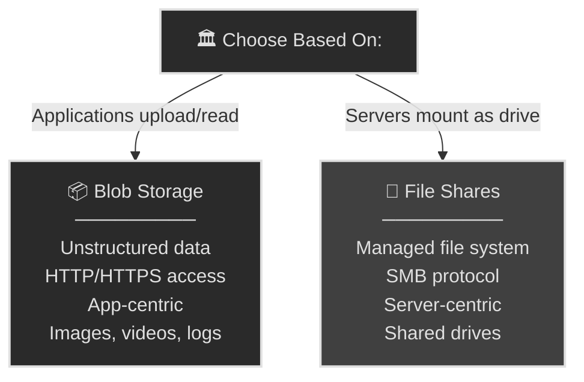
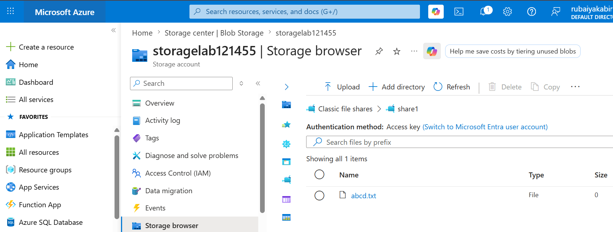
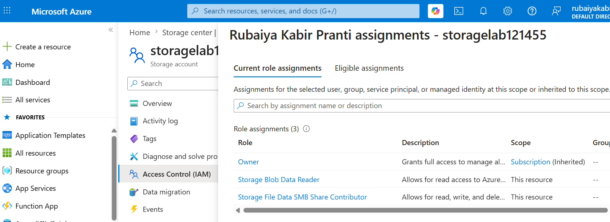
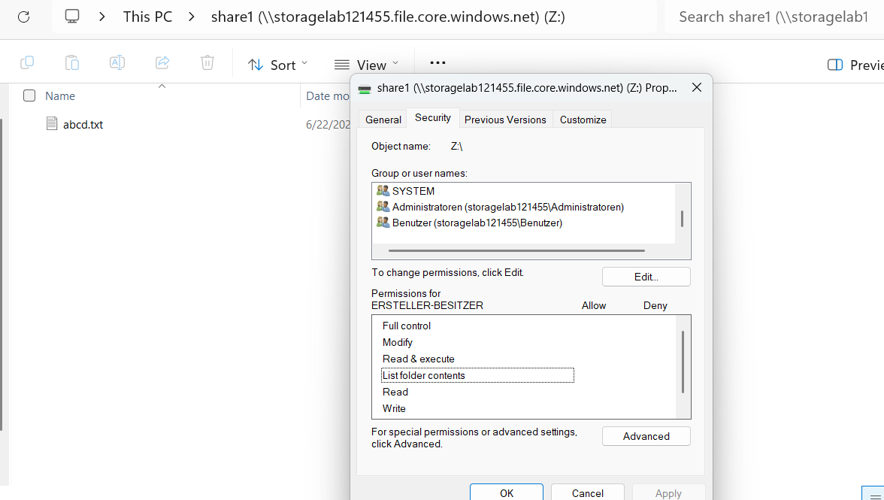
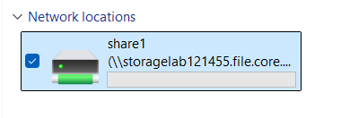

# 📁 Azure File Storage: Shares and Access (AZ-104, portal-built)

This is the continuation of Lab 02 (02b), focusing on **Azure File Shares** - a managed file sharing service using the SMB protocol. Where Blob Storage is for unstructured data (documents, media), File Storage is for **shared network file access** (similar to on-premises file servers).

**Exam status:** AZ-104 requires understanding blob storage, but file shares appear in real-world scenarios and some exam questions about hybrid cloud and file sharing.

## 📋 The Scenario

**Fictional assignment:**
An app team needs **shared file access** across multiple virtual machines and on-premises servers.

**Responsibilities:**

**✓ Create a shared file location**
- Multiple VMs mount the same file share
- Access is controlled via SMB protocol
- Permissions prevent unauthorized access

**✓ Manage file storage tiers**
- Hot tier for frequently accessed files
- Cool tier for infrequent access
- Understand cost implications

**✓ Implement access control**
- Storage account keys for machine authentication
- RBAC roles for identity-based access
- File-level permissions (NTFS-style)

**What I learn:**
- Difference between File Shares and Blob Storage
- How to create and configure file shares
- Mounting file shares on Windows, Linux, macOS
- Access tiers and cost optimization
- Storage Browser for file management

## 🏗️ File Shares vs Blob Storage



| Feature | Blob Storage | File Shares |
|---------|--------------|-------------|
| **Protocol** | HTTP/HTTPS (REST API) | SMB 3.0 |
| **Mount method** | API calls from app | Drive mount (Z:, /mnt) |
| **Use case** | Unstructured data (images, videos) | Shared file access (team folders) |
| **Access model** | Per-blob (individual files) | Directory tree (folder structure) |
| **On-premises access** | No | Yes (over VPN) |
| **Permissions** | RBAC roles, SAS tokens | RBAC + NTFS-style ACLs |
| **Cost** | Pay per access tier | Pay per provisioned size |

## ✅ Before I started

- An Azure subscription where I am the Owner
- A storage account (from Lab 02, or create a new one)
- About 30 minutes

## 📦 Phase 1 - Create a file share

### 📂 Create the file share

**Steps:**
1. In the left menu, search for **File shares** (under "Data storage")
2. Select **+ File share**
3. Fill in the details:
   - **Name:** `share1`
   - **Tier:** **Transaction optimized** (standard tier, best for general use)
   - **Quota:** 100 GB (adjust based on needs)
5. On the **Backup** tab: uncheck **Enable backup** (simplifies lab)
6. Review and create

**What I get:**
- A managed file share accessible via SMB protocol
- Can be mounted on Windows, Linux, or macOS
- Built-in quota management
- Integrated with Azure storage redundancy


*Creating a new file share with transaction optimized tier.*

**Access tiers for file shares:**

| Tier | Use case | Cost | Performance |
|------|----------|------|-------------|
| **Transaction optimized** | General purpose, mixed workloads | Standard cost (~$0.03/GB/month) | Standard throughput |
| **Hot** | Frequently accessed files | Higher cost | Higher throughput |
| **Cool** | Infrequent access, archives | Lower cost (~$0.01/GB/month) | Lower throughput |

**Why Transaction optimized for this lab:**
- Balanced cost and performance
- Works for most enterprise scenarios
- No rehydration delays (unlike Archive tier in Blob Storage)

### 📤 Upload a file to the share

**Using Storage Browser (GUI):**
1. Go back to the storage account
2. Select **Storage browser** from the left menu
3. Expand **File shares** and click on **share1**
4. Select **Upload**
5. Choose a file from my computer
6. Click **Upload**

**Result:**
- File now appears in the share
- All VMs/machines with access can see and download it



*Storage Browser lets you quickly upload files to file shares.*

**Important note about Storage Browser:**
- If I see an authorization error, select **Switch Azure AD Account** in the toolbar
- This ensures I am authenticated with the right identity

## 🔐 Phase 2 - Access methods for file shares

File shares support multiple access patterns, similar to Blob Storage but optimized for server-based access.

### 1️⃣ Storage account key (full access)

**How it works:**
1. Open the storage account
2. Select **Access keys**
3. Copy the connection string or storage account key
4. Use it to mount the file share on a machine

**Authentication string format (Windows):**
```
net use Z: \\storagelab121455.file.core.windows.net\share1 /user:Azure\storagelab121455 <storage-key>
```

**Why this is useful:**
- Full read/write access to all file shares in the account
- Works across all machines

**Security consideration:**
- Keys grant unlimited access
- Rotate keys regularly in production
- Use RBAC roles instead when possible

### 2️⃣ RBAC roles (identity-based)

**Available roles:**
- **Storage File Data SMB Share Reader** - read-only access via SMB
- **Storage File Data SMB Share Contributor** - read/write access via SMB
- **Storage File Data SMB Share Elevated Contributor** - read/write + modify permissions



**How to assign (Azure AD):**
1. Open the storage account
2. Select **Access control (IAM)**
3. Select **+ Add role assignment**
4. Choose role (e.g., Storage File Data SMB Share Reader)
5. Assign to user or group
3. The user can now mount the share using Azure AD credentials

**Mounting with Azure AD (Windows 10+, Azure AD joined):**
```
net use Z: \\storagelab121455.file.core.windows.net\share1
```
(No password needed - uses Azure AD sign-in)

**Why this is more secure:**
- No credential sharing
- Auditable (who accessed what, when)
- Can be revoked instantly

### 3️⃣ NTFS-level permissions

After mounting a file share, you can set **directory and file permissions** just like on-premises file servers.

**Example:**
1. Mount the file share on a Windows VM (becomes Z: drive)
2. Right-click a folder → **Properties** → **Security**
3. Set NTFS permissions (Read, Modify, Full Control)
4. Different users get different folder access



**Two-layer security:**
- **Layer 1:** SMB authentication (storage account key or RBAC role)
- **Layer 2:** NTFS permissions (folder and file level)

Both must allow access for a user to read a file.

## 🔌 Phase 3 - Mount a file share

### Windows VM: Mount via net use command

**Steps:**
1. Open Command Prompt (admin) or PowerShell
2. Run this command:
   ```
   net use Z: \\storagelab121455.file.core.windows.net\share1 /user:Azure\storagelab121455 <storage-key>
   ```
   Replace:
   - `storagelab121455` with the storage account name
   - `<storage-key>` with the key from Access keys

3. Press Enter
4. Check File Explorer - Z: drive should appear

**Result:**
- The file share is now mounted as a Z: drive
- Appears like a local network drive
- Can access files with UNC path: `\\storagelab121455.file.core.windows.net\share1`



**Troubleshooting net use:**
- Error 67 "The network name cannot be found" → Check storage account name spelling
- Error "System error 5" → Run Command Prompt as admin
- Error "Multiple connections to this server" → Disconnect existing mount: `net use Z: /delete`

### Linux VM: Mount via SMB

**Steps:**
1. Install SMB utilities:
   ```bash
   sudo apt-get install cifs-utils
   ```

2. Create a mount point:
   ```bash
   sudo mkdir /mnt/azure
   ```

3. Mount the share:
   ```bash
   sudo mount -t cifs //storagelab121455.file.core.windows.net/share1 /mnt/azure -o username=storagelab121455,password=<storage-key>,vers=3.0
   ```

4. Verify the mount:
   ```bash
   ls /mnt/azure
   ```

**Result:**
- Files appear at `/mnt/azure`
- Can access like any mounted filesystem

### macOS: Mount via Finder

**Steps:**
1. Open Finder → Go → Connect to Server
2. Enter SMB address:
   ```
   smb://storagelab121455.file.core.windows.net/share1
   ```
3. Click Connect
4. Enter credentials:
   - Username: `storagelab121455` (or Azure\storagelab121455)
   - Password: storage account key
5. Click Connect

**Result:**
- File share appears in Finder
- Can drag/drop files like any network share

## 📊 When to use file shares

| Scenario | Solution | Why |
|----------|----------|-----|
| App uploads images to storage | Blob Storage | HTTP-based, cost-effective for unstructured data |
| Team shares files across VMs | File Shares | SMB protocol, shared drive experience |
| Legacy app needs network drive | File Shares | Works like on-premises file server |
| Audit logs for compliance | Blob Storage | Write-once, immutable options available |
| Database backups on shared storage | File Shares | Multiple servers access same location |
| Analytics pipeline reads datasets | Blob Storage | Optimized for large sequential reads |

## 🔐 Deep dive: Storage account key vs RBAC

**Storage account key (connection-level auth):**
- I provide the key to every machine/user that needs access
- Key works for everything: files, blobs, tables, queues
- Cannot be audited per-user (just "someone with the key" accessed it)
- If leaked, rotate it (affects all users)
- Use for: applications, automated scripts

**RBAC role (identity-level auth):**
- User authenticates with Azure AD (username and password)
- Role restricts what they can do (read-only, read/write, etc.)
- Every action is audited with the user's identity
- If compromised, remove the role (does not affect others)
- Use for: employees, on-premises servers via VPN (Azure AD hybrid)

**Production recommendation:**
- Use RBAC roles for user access
- Use managed identities for application access (beyond scope of this lab)
- Rotate storage account keys quarterly as emergency backup

## 📋 Common Issues and Solutions

For detailed troubleshooting of real-world issues encountered during file share setup, including firewall configurations, authentication problems, and access control challenges, see the **[Issues and Troubleshooting Guide](Issues.md)**.

This guide covers:
- File share upload authorization failures
- RBAC role propagation delays
- Firewall blocking and network access issues
- Storage account key authentication workarounds

## 🧯 Break it and fix it

**Scenario 1: Permission denied when mounting**

Error: `System error 5: Access is denied`

Troubleshoot:
- Check storage account key is correct (copy-paste again)
- Verify file share name spelling
- Ensure RBAC role is assigned (if using Azure AD)
- Try running as admin (Windows)

**Scenario 2: SMB 3.0 protocol not available**

Error: `Cannot mount - requires SMB 3.0`

Troubleshoot:
- Linux: Install cifs-utils (`apt-get install cifs-utils`)
- macOS: Update OS (SMB 3.0 required)
- Windows: Should be built-in; update if needed

**Scenario 3: File share quota exceeded**

Error: `No space left on device`

Fix:
- Delete old files from the share
- Increase quota:
  1. Open storage account → File shares
  2. Select the share
  3. Increase **Quota** value
  4. Save

## 🎯 Key points this lab reinforces

**File Shares fundamentals:**
- SMB protocol vs HTTP (Blob Storage)
- Mount as network drive (Z:, /mnt)
- Works on-premises over VPN

**Access methods:**
- Storage account key: unlimited, not auditable per-user
- RBAC roles: auditable, granular, more secure
- NTFS permissions: file-level granularity

**When to use:**
- Shared file access → File Shares
- Unstructured data storage → Blob Storage
- Hybrid cloud with on-premises servers → File Shares

**Important concepts for AZ-104:**
- File Shares ≠ Blob Storage (different protocols, use cases)
- SMB protocol requires on-premises network connectivity
- Storage account key grants full access (like admin password)
- RBAC roles are safer (identity-based, auditable)
- Two-layer permissions: SMB auth + NTFS ACLs

## 🏭 If this were production, not a lab

**What I will do differently:**

**Access:**
- Disable storage account key access entirely (set keys to read-only, use RBAC)
- Use managed identities for applications
- Assign RBAC roles to Azure AD groups (avoid individuals)

**Resilience:**
- Use RA-GZRS redundancy (readable paired region)
- Enable soft delete (recover accidentally deleted files)
- Regular backups to separate storage account

**Security:**
- Firewall: Deny public endpoint, allow only VNets
- Private endpoint: Access from private IP
- Encryption: Customer-managed keys in Key Vault
- Network: VPN/ExpressRoute for on-premises access

**Monitoring:**
- Log all access via Azure Monitor
- Alert on failed authentication attempts
- Enforce conditional access policies (MFA, device compliance)

**Permissions:**
- Minimal privilege NTFS ACLs
- Separate folders for different teams
- Regular access reviews

---

*Part of my AZ-104 hands-on set. Built in the portal. See `cli-reference/commands.md` for the same steps as `az` commands.*
