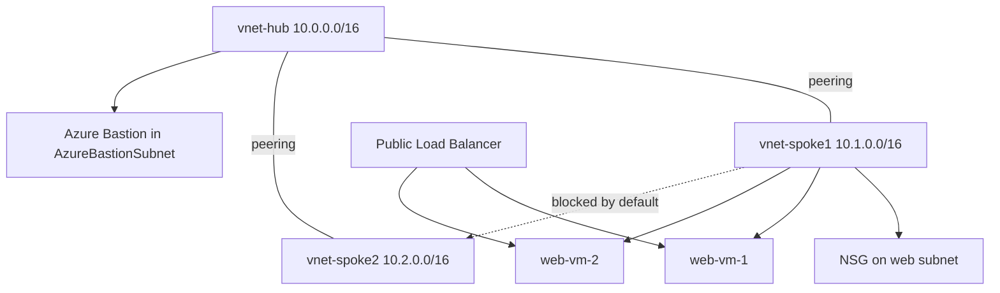

# 🌐 Hub-Spoke Network: NSGs, Bastion, and Load Balancer (AZ-104, portal-built)

This is the third lab. It looks the most like the diagrams the exam shows.

Networking is the fiddly part of AZ-104. So this lab focuses on two things people get wrong:
- How NSG rules are evaluated.
- Why traffic between two spokes does not flow, even when both are peered to the hub.

**The scenario:** I build a small hub-and-spoke network.

The needs:
- A hub VNet for shared services.
- Two spoke VNets for workloads.
- Admin access to the VMs. No RDP or SSH exposed to the internet.
- A load balancer across two web VMs.

## 🏗️ What I build here

## 🧠 What does what (my mental model)
A quick map of the pieces in this lab:
- **VNet** = a private network in Azure. It has its own address range.
- **Subnet** = a slice of a VNet. Resources live in subnets.
- **NIC** = the network card on a VM. It joins the VM to a subnet.
- **Peering** = a link between two VNets. It lets them talk.
- **NSG** = a set of allow and deny rules. It sits on a subnet or a NIC.
- **Bastion** = RDP or SSH from the browser. No public IP on the VM.
- **Load Balancer** = spreads traffic across VMs. Layer 4.
- **Application Gateway** = a web load balancer. Layer 7, with URL routing and WAF.
- **UDR (user-defined route)** = a custom route. It sends traffic where I choose, like through the hub.

## ✅ Before I started
- An Azure subscription where I am the Owner.
- A few small VMs. I delete them when I am done, so I do not waste credit.
- About 60 minutes.

## 🗺️ Phase 1 - VNets and subnets
1. Create three VNets:
   - `vnet-hub` (10.0.0.0/16)
   - `vnet-spoke1` (10.1.0.0/16)
   - `vnet-spoke2` (10.2.0.0/16)
2. Give `vnet-spoke1` a subnet named `web`.

**Important detail:**
- Azure reserves 5 IPs in every subnet.
- It takes the first four and the last one.
- So a `/24` gives 251 usable IPs, not 256.
- If a question asks how many hosts fit, subtract 5.

*The web subnet inside vnet-spoke1.*

## 🔗 Phase 2 - Peer the networks
1. Peer the hub to spoke1.
2. Peer the hub to spoke2.
3. Allow the direction you need on each peering.
4. Wait for both sides to show **Connected**.

A peering links two VNets. But it does not open traffic on its own. I allow the direction I want.

*The topology: the hub peered to both spokes.*

*Both peerings show Connected.*

## 🚦 Phase 3 - NSG rules
1. Put an NSG on the `web` subnet.
2. Add an inbound rule: allow port 443, priority 100.
3. Add another inbound rule: deny port 80, priority 200.

The rules the exam tests:
- Lowest priority number wins. The first match stops the check. So 100 beats 200.
- NSGs are stateful. Allow traffic in, and the reply is allowed back out. No return rule needed.
- An NSG can sit on the subnet and on the NIC. Both apply. Azure checks the subnet NSG first, then the NIC NSG.
- Default rules already deny inbound from the internet. They allow traffic inside the VNet.

To debug a blocked connection:
- Open the VM's NIC.
- Look at **Effective security rules**.
- This shows the merged subnet and NIC rules.
- When traffic is blocked for no clear reason, I look here first.

*Allow 443 at priority 100, deny 80 at priority 200.*

*The merged subnet and NIC rules.*

## 🏰 Phase 4 - Bastion (admin without public IPs)
Bastion lets me connect to a VM from the browser. The VM needs no public IP.

1. Deploy **Azure Bastion** into the hub.
2. Connect to a VM that has no public IP, from the browser.

**Important detail:**
- The subnet must be named exactly `AzureBastionSubnet`.
- It must be `/26` or larger.

This answers every "secure RDP or SSH without exposing port 3389 or 22" question.

*Connecting from the browser. The VM has no public IP.*

## ⚖️ Phase 5 - Load Balancer
1. Create two small web VMs in spoke1.
2. Install nginx or IIS, so each VM shows its own hostname.
3. Create a public **Standard Load Balancer**.
4. Add a frontend IP.
5. Add a backend pool with both VMs.
6. Add a health probe.
7. Add a load-balancing rule on port 80.
8. Open the public IP and refresh. I should land on different VMs.

Pick the right load balancer:
- **Azure Load Balancer**: Layer 4 (TCP/UDP). Cannot read URLs.
- **Application Gateway**: Layer 7. URL and path routing, SSL offload, WAF.
- **Traffic Manager** and **Front Door**: global. Route across regions.

So "route by URL path" or "WAF" means Application Gateway. Not the basic Load Balancer.

*The backend pool with both web VMs.*

*The health probe on port 80.*

*Refreshing the public IP lands on different VMs.*

## 🧯 Break it and fix it
1. From a VM in **spoke1**, try to reach a VM in **spoke2**. It fails.
2. Both are peered to the hub. So why does it fail?

The reason:
- VNet peering is not transitive.
- spoke1 to hub, plus hub to spoke2, does not connect spoke1 to spoke2.

The fix:
- Send the traffic through the hub.
- Add a user-defined route (UDR) pointing at a firewall or NVA in the hub.
- For a quick lab fix, peer the two spokes directly.
- Then test again. It works.

*spoke1 cannot reach spoke2. Peering is not transitive.*

*After the fix, spoke1 reaches spoke2 through the hub.*

## 📝 Quick notes (memorize these)
- Reserved IPs per subnet: **5** (the first four and the last). A `/24` gives 251 usable.
- NSG priority: **lower number wins**. The first match stops the check.
- NSG default: deny inbound from the internet at priority **65500**.
- NSGs are **stateful**. No return rule needed.
- Bastion subnet: name it **`AzureBastionSubnet`** exactly. Size **`/26`** or larger.
- Peering is **not transitive**.
- Load Balancer = **Layer 4**. Application Gateway = **Layer 7**. Traffic Manager and Front Door = **global**.

## 🎯 Key points this lab reinforces
- NSG: lowest priority number wins. Stateful. Subnet and NIC NSGs both apply.
- Effective security rules is the troubleshooting view.
- Peering is not transitive. Spokes need a UDR plus a hub appliance, or direct peering.
- Bastion subnet: named `AzureBastionSubnet`, `/26` or larger.
- Every subnet has 5 reserved IPs.
- Load Balancer is Layer 4. Application Gateway is Layer 7. Traffic Manager and Front Door are global.

## 🏭 If this were production, not a lab
- The hub would run **Azure Firewall**.
- UDRs would force all spoke traffic through it.
- The peerings would use **gateway transit**. The spokes then share one VPN or ExpressRoute gateway.
- The web tier would sit behind **Application Gateway** with WAF, in front of the load balancer.

---
*Part of my AZ-104 hands-on set. Built in the portal. See `cli-reference/commands.md` for the same steps as `az` commands.*