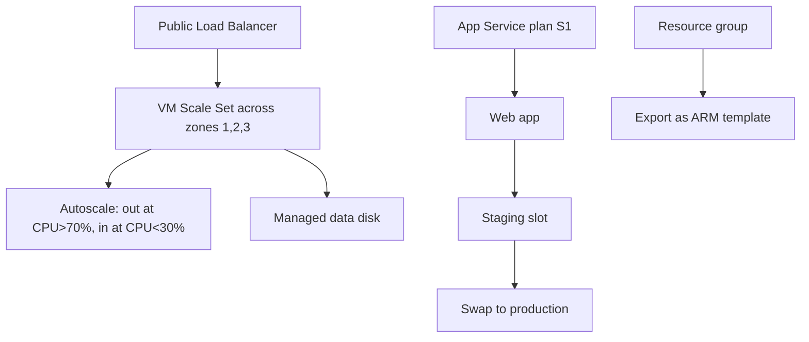

# ⚡ Autoscaling Web Tier: VM Scale Sets + Load Balancer (AZ-104, portal-built)

This is the fourth lab in my AZ-104 set. Compute is the joint-biggest exam domain, and the part people fumble is the availability story: set vs zone vs scale set, and scale-up vs scale-out. This lab builds a small web tier that grows under load and shrinks when it is quiet, then adds the App Service pieces the exam also tests.

**Exam status:** Not yet attempted. This lab builds practical compute scaling and availability skills tested in AZ-104.

## 📋 The Scenario

**Fictional assignment:**
I have been handed a requirement to stand up a **web tier for an app that gets busy at peak and idle at night**.

**Responsibilities:**

**✓ Servers add and remove automatically under load**
- Scale out when CPU climbs above threshold
- Scale in when load drops to keep costs low

**✓ The web tier survives a datacentre outage**
- Deploy across availability zones, not just a single datacentre
- Sit behind a load balancer

**✓ New versions deploy without downtime**
- Use deployment slots to test before swapping to production
- Roll back instantly if something goes wrong

**✓ The infrastructure can be reproduced from code**
- Export the resource group as an ARM template
- Understand the difference between Incremental and Complete mode

**What I learn:**
- The difference between availability sets, zones, and scale sets
- How autoscale rules fire and what makes them fail silently
- How App Service slots enable near-zero-downtime deploys
- ARM template modes and what Complete mode deletes

## 🏗️ What I build here



## 🧠 Core concepts: availability and scaling

### What protects against what

| Construct | Protects against | What it does not do |
|---|---|---|
| **Availability set** | Hardware or rack failure inside one datacentre (fault and update domains) | Does not protect against a whole zone or region failing |
| **Availability zones** | A whole datacentre (zone) failing | Does not add or remove VMs automatically |
| **VM Scale Set** | Use with zones for resilience | Handles elastic auto-scaling of identical VMs |

The exam asks this constantly. For "survive a datacentre outage" the answer is availability zones. For "add servers under load" the answer is a scale set. A plain availability set does not scale, and once a VM is created in an availability set, that assignment cannot be changed.

### Scaling vocabulary

- **Scale out** = add more instances (horizontal). This is what autoscale does.
- **Scale in** = remove instances (horizontal).
- **Scale up** = move to a larger SKU with more CPU or RAM (vertical).
- **Scale down** = move to a smaller SKU.

An exam question about handling more traffic always points to scale out. "Need more memory per instance" points to scale up.

## ✅ Before I started

- An Azure subscription where I am the Owner.
- Scale sets spin up real VMs. I kept the minimum instance count at 2 and deleted the lab when done.

## 🔍 Phase 1 - The availability decision

I made this decision before touching the portal. The availability model is set at deployment and cannot be changed afterwards.

**My requirement:** Survive a datacentre outage AND scale under load.

**Decision:** Deploy the VM Scale Set across **availability zones 1, 2, and 3**.

Zones and scale sets work together. The zone spread handles the "survive a datacentre failure" part. The scale set handles the "grow under load" part. I did not use an availability set here because scale sets manage fault and update domain logic internally when zones are set.

**The thing people get wrong:**
- A VM already created outside an availability set cannot be added to one afterwards.
- An availability set does not scale.
- Scale set with zones gives both resilience and elasticity in one resource.

## ⚙️ Phase 2 - Build the scale set

1. In the portal, search for **Virtual machine scale sets** and select **Create**.
2. Set **Subscription** and **Resource group** (I created `rg-compute-lab`).
3. Set **Scale set name** to `vmss-web`.
4. Set **Region** to my chosen region.
5. Under **Availability zones**, select **Zones 1, 2, 3**.
6. Set **Orchestration mode** to **Uniform** (all instances identical, which is what the exam covers).
7. Pick a small Linux image (Ubuntu Server 20.04 LTS).
8. Set **Size** to a small SKU (Standard_B1s) to keep costs low.
9. Set **Initial instance count** to `2`.
10. On the **Networking** tab, let the wizard create a load balancer.
11. On the **Advanced** tab, paste a cloud-init script to install a small web server:

    ```bash
    #!/bin/bash
    apt-get update -y
    apt-get install -y nginx
    echo "<h1>Instance: $(hostname)</h1>" > /var/www/html/index.html
    ```

12. Select **Review + create** > **Create**.

**What to check after creation:**
- Open the scale set and select **Instances**. Two instances should appear, spread across zones.
- Open the load balancer. Under **Backend pools**, the scale set instances should be listed.
- Hit the load balancer's public IP in a browser and confirm the page loads.


*The scale set spread across zones 1, 2, and 3 during creation.*


*Two instances created, spread across zones.*


*The public load balancer with the scale set as its backend pool.*

## 📈 Phase 3 - Autoscale

1. Open the scale set (`vmss-web`).
2. Select **Scaling** from the left menu.
3. Select **Custom autoscale**.
4. Set **Minimum** to `2`, **Maximum** to `5`, **Default** to `2`.
5. Select **+ Add a rule**.
6. Set **Metric source** to the scale set, **Metric name** to **Percentage CPU**.
7. Set **Operator** to **Greater than**, **Threshold** to `70`, **Duration** to `5 minutes`.
8. Set **Operation** to **Increase count by 1**.
9. Save. Then add a second rule:
   - Same metric, operator **Less than**, threshold `30`.
   - Operation: **Decrease count by 1**.
10. Save the autoscale setting.

**Make the rule fire:**
1. SSH into one of the instances through the load balancer public IP.
2. Install the stress tool: `sudo apt-get install -y stress`.
3. Run: `stress --cpu 4 --timeout 300` (runs for 5 minutes).
4. Go back to the portal and watch **Run history** under Scaling. Within a few minutes, a scale-out event should appear.

Capturing a real scale event in Run history is the screenshot that shows this lab was actually done, not just read.

**Details worth knowing:**
- Autoscale rules fire based on averages across the whole scale set, not one instance.
- There is a cooldown period between scale events (default 5 minutes) to prevent rapid thrashing.
- If the maximum is set equal to the minimum, the scale set is pinned and nothing scales.


*Scale-out rule at CPU over 70%, scale-in at CPU under 30%.*


*A scale-out event captured in Run history after CPU spiked.*

## 💾 Phase 4 - Managed data disk

1. Open the scale set and select one instance.
2. Select **Disks** from the left menu.
3. Select **+ Add data disk**.
4. Create a new managed disk (32 GB is enough for a lab).
5. Attach it and save.

**Important detail about disk operations:**
- Resizing a VM's SKU (scale up) requires the VM to be **deallocated** first.
- Resizing a disk also usually requires the VM to be **deallocated**.
- "Stopped" in the portal is not the same as deallocated. A stopped VM still holds compute resources and still bills for CPU.
- "Stopped (deallocated)" releases the compute and stops billing.

**How to deallocate:**
- On the instance, select **Stop**. The portal asks whether to deallocate. Confirm.
- Wait for status to show **Stopped (deallocated)**, then resize or attach the disk, then restart.


*A managed data disk attached to a scale set instance.*

## 🌐 Phase 5 - App Service and deployment slots

This is a different compute model in the same exam domain.

**Create the App Service plan:**
1. Search for **App Service plans** and select **Create**.
2. Set **Pricing tier** to **Standard S1**. Deployment slots and autoscale require Standard or higher. Free and Basic tiers do not support either.
3. Select **Review + create** > **Create**.

**Create the web app:**
1. Search for **App Services** and select **Create** > **Web App**.
2. Set the **App Service plan** to the S1 plan I just created.
3. Select **Review + create** > **Create**.

**Create a staging slot:**
1. Open the web app.
2. Select **Deployment slots** from the left menu.
3. Select **+ Add slot**, name it `staging`.
4. Choose to clone settings from production so the slot is configured the same way.

**Make a visible change in staging:**
1. Under **Deployment slots**, open the **staging** slot.
2. Change the default page content or add an application setting that shows a visible difference.
3. Browse to the staging slot URL and confirm the change shows.
4. Browse to the production URL and confirm it does not show there yet.

**Swap staging to production:**
1. Back on the web app, select **Deployment slots** > **Swap**.
2. Set source to `staging`, target to `production`.
3. Select **Swap**.
4. Browse to the production URL. It now shows the staging content.
5. The swap is reversible: swap back to roll back.

**Why this matters:**
- The staging slot warms up before the swap, so users see no cold start.
- If the new version breaks in production, one more swap reverts it instantly.


*App Service plan at Standard S1, required for slots and autoscale.*


*The staging slot alongside the production slot.*


*Swapping staging into production.*

## 📦 Phase 6 - Export as ARM template

1. Open the resource group (`rg-compute-lab`).
2. Select **Automation** > **Export template** from the left menu.
3. Wait for the portal to build the template.
4. Download the ZIP file. It contains `template.json` and `parameters.json`.
5. I committed the exported template into this repo to show the resources as code.

**Optional:** Run `az bicep decompile --file template.json` to see the cleaner Bicep format.

**ARM deployment modes:**
- **Incremental** (default): adds and updates resources in the template, leaves everything else in the resource group alone.
- **Complete**: deploys only what is in the template and **deletes** any resource in the resource group that is not listed in it.

If an exam question describes unexpected deletions after a deployment, the answer is Complete mode was used.


*The exported ARM template JSON for the compute lab resource group.*

## 🧯 Break it and fix it

I set the autoscale **maximum** to `2` and the **minimum** to `2`, then generated CPU load. Nothing scaled. The scale set is pinned at 2 because the maximum is a hard ceiling, not a target.

I read the autoscale settings and spotted the problem: maximum equals minimum means no room to grow. I raised the maximum to `5`, generated load again, and watched it scale out.

This teaches me to read autoscale configuration the way the exam phrases questions about it. A scale set that will not grow usually has its maximum set too low.

## 🎯 Key points this lab reinforces

**Availability:**
- Availability set = rack-level protection. Cannot add an existing VM to one after creation.
- Availability zones = datacentre-level protection. Highest single-region SLA.
- VMSS = elastic scaling. Combine with zones for resilience plus elasticity.

**Scaling vocabulary:**
- Scale out/in = change the count of instances.
- Scale up/down = change the size (SKU). Requires deallocating first.
- "Stopped (deallocated)" = compute released, billing stopped. Not the same as just "stopped".

**App Service:**
- Slots and autoscale require Standard tier or higher. Free and Basic tiers do not support either.
- Slot swap = near-zero downtime deploy with instant rollback capability.

**ARM:**
- Incremental mode = safe and additive. This is the default.
- Complete mode = deletes anything in the resource group that is not in the template.

## 🏭 If this were production, not a lab

- I would bake the web server into a custom image instead of installing it at boot via custom data. Boot time is faster and the image is repeatable.
- App Gateway with WAF would sit in front of the load balancer for Layer 7 routing and inspection.
- Deployments would go through a pipeline into the staging slot, with automated health checks before the swap triggers.
- Autoscale rules would also cover memory and request queue depth, not just CPU alone.

---
*Part of my AZ-104 hands-on set. Built in the portal. See `cli-reference/commands.md` for the same steps as `az` commands.*
