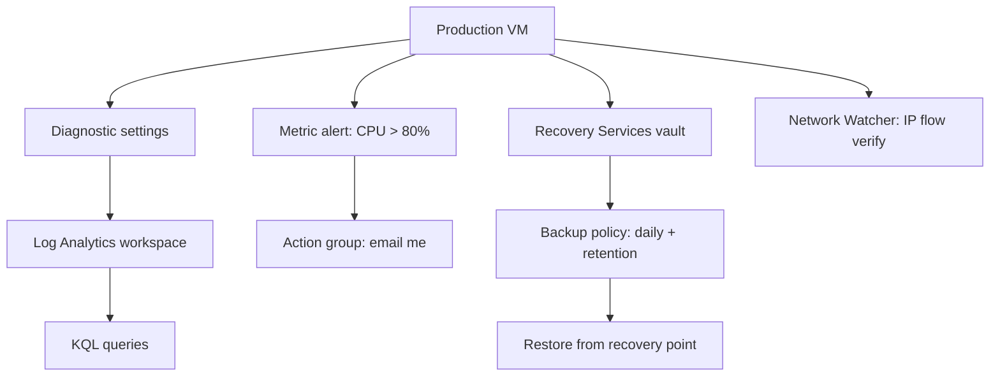

# 📊 Monitoring, Alerting and Backup (AZ-104, portal-built)

This is the fifth lab in my AZ-104 set. Monitoring is one of the smaller exam domains but it carries easy marks if I can keep two pairs straight: metrics vs logs, and Backup vs Site Recovery. This lab makes me wire up a real alert that emails me, back up a VM and restore it, and use Network Watcher to catch a blocking NSG rule.

**Exam status:** Not yet attempted. This lab builds VM monitoring, alerting, backup, and recovery skills tested in AZ-104.

## 📋 The Scenario

**Fictional assignment:**
I have been handed a production VM and told to **make sure someone gets paged if it goes wrong, and that it can be recovered if it is lost**.

**Responsibilities:**

**✓ Problems are visible before they become outages**
- Send diagnostic logs and metrics to a central Log Analytics workspace
- Query the data to confirm it is flowing

**✓ Someone gets paged when CPU spikes**
- Create a metric alert with a threshold
- Wire it to an action group that emails me
- Make the alert actually fire and catch the email

**✓ The VM can be restored if it is deleted or corrupted**
- Create a Recovery Services vault with a backup policy
- Run an on-demand backup
- Restore from a recovery point

**✓ Blocked network traffic can be diagnosed fast**
- Use Network Watcher to identify the NSG rule responsible
- Understand the difference between IP flow verify and Next hop

**What I learn:**
- The difference between metrics and logs, and when each is the right tool
- Why an alert rule on its own does not notify anyone
- The difference between Azure Backup and Azure Site Recovery
- How to diagnose a blocked port without guessing

## 🏗️ What I build here



## 🧠 Core concepts: two pairs to keep straight

### Metrics vs logs

| | Metrics | Logs |
|---|---|---|
| What they contain | Numeric time-series data (CPU %, disk IOPS, network bytes) | Rich event and diagnostic text data |
| How they are stored | Azure Monitor Metrics store (automatic) | Log Analytics workspace (queried with KQL) |
| Latency | Near real-time (seconds to minutes) | Minutes (ingestion delay) |
| Good for | Quick threshold alerts, dashboards, autoscale triggers | Correlating events, querying text, long-term analysis |

When an exam question mentions a **Log Analytics workspace** or **querying events**, the answer is logs. When it mentions a **CPU threshold alert** or **real-time dashboard**, the answer is metrics.

### Backup vs Site Recovery

| | Azure Backup | Azure Site Recovery (ASR) |
|---|---|---|
| Purpose | Restore a VM or file to a point in time | Keep a workload running through a region outage |
| Trigger | Scheduled backup policy or on-demand | Continuous replication to secondary region |
| Recovery | Restore VM or individual files from a recovery point | Fail over to secondary region |
| Scenario | "Restore the deleted VM from yesterday" | "Keep the app running if the whole region goes down" |

These are different tools for different problems. Backup is for restore. Site Recovery is for failover.

## ✅ Before I started

- An Azure subscription where I am the Owner.
- One small VM. I reused one from an earlier lab, or created a new small one.

## 🗃️ Phase 1 - Log Analytics workspace and diagnostic settings

**Create the workspace:**
1. Search for **Log Analytics workspaces** and select **Create**.
2. Set **Subscription**, **Resource group**, and **Name** (I used `law-lab`).
3. Set **Region** to the same region as the VM.
4. Select **Review + create** > **Create**.

**Connect the VM:**
1. Open the VM.
2. Select **Diagnostic settings** from the left menu (under Monitoring).
3. Select **+ Add diagnostic setting**.
4. Give it a name.
5. Under **Destination details**, tick **Send to Log Analytics workspace** and select `law-lab`.
6. Under **Categories**, tick **AllMetrics** and **AuditEvent** (or equivalent platform logs).
7. Select **Save**.

**What this sets up:**
- Platform metrics (CPU, disk, network) are sent to the workspace.
- Diagnostic logs are sent to the workspace.
- Data starts flowing within a few minutes.


*The Log Analytics workspace in the resource group.*


*Diagnostic settings pointing the VM at the Log Analytics workspace.*

## 🔍 Phase 2 - Query with KQL

1. Open the Log Analytics workspace (`law-lab`).
2. Select **Logs** from the left menu.
3. Run a query to confirm data is flowing:

```kusto
Heartbeat
| where TimeGenerated > ago(30m)
| summarize count() by Computer
```

Or something simpler:

```kusto
AzureActivity | take 50
```

**What I am checking:**
- That rows appear in the results (data is flowing).
- That the Computer field shows the VM name.
- If the query returns nothing, wait a few more minutes for ingestion, then try again.

For AZ-104, I do not need to write complex KQL. I need to recognise that querying logs happens here, in the workspace, in this language. Any question about searching log data or event history points to KQL in a Log Analytics workspace.


*A Heartbeat query confirming the VM is sending data to the workspace.*

## 🔔 Phase 3 - An alert that actually emails someone

**Create the alert rule:**
1. Search for **Monitor** and open it.
2. Select **Alerts** > **+ Create** > **Alert rule**.
3. Under **Scope**, select the VM.
4. Under **Condition**, select **Add condition**.
5. Search for and select **Percentage CPU**.
6. Set **Operator** to **Greater than**, **Threshold** to `80`.
7. Set **Aggregation type** to **Average**, **Period** to `5 minutes`.
8. Select **Done**.

**Create the action group:**
1. Under **Actions**, select **+ Create action group**.
2. Set **Action group name** and **Display name**.
3. On the **Notifications** tab, add an action of type **Email/SMS message/Push/Voice**.
4. Enter my email address.
5. Select **Review + create** > **Create**.
6. Back in the alert rule, confirm the action group is attached.
7. Give the alert rule a name and select **Review + create** > **Create**.

**Make the alert fire:**
1. SSH into the VM.
2. Run a CPU load command: `yes > /dev/null &` (or install `stress` and run `stress --cpu 2`).
3. After a few minutes, go to **Monitor** > **Alerts**.
4. The alert should show as **Fired**.
5. Check email for the notification.

**The exam trap:**
An alert rule detects the condition. It does nothing else on its own. The **action group** is what sends the email, SMS, webhook, or triggers a Logic App or runbook. No action group attached means detection happens but nobody is told.

**Bonus concept:** An **alert processing rule** lets me modify alert behaviour without editing every alert rule. For example, suppressing all alerts during a maintenance window instead of deleting and recreating the rules.


*The metric alert targeting CPU above 80% on the VM.*


*The action group set to email me when triggered.*


*The alert in Fired state after CPU spiked.*

## 💾 Phase 4 - Backup and restore

**Create the Recovery Services vault:**
1. Search for **Recovery Services vaults** and select **Create**.
2. Set **Subscription**, **Resource group**, and **Name** (I used `rsv-lab`).
3. Set **Region** to the same region as the VM.
4. Select **Review + create** > **Create**.

**Configure backup for the VM:**
1. Open the vault (`rsv-lab`).
2. Select **Backup** from the left menu.
3. Under **Where is your workload running?**, select **Azure**.
4. Under **What do you want to back up?**, select **Virtual machine**.
5. Select **Backup**.
6. Select the VM from the list.
7. Review the backup policy (daily with 30-day retention is fine for this lab).
8. Select **Enable Backup**.

**Run an on-demand backup:**
1. Under **Protected items** > **Backup items**, find the VM.
2. Select it and choose **Backup now**.
3. Set the retention date and confirm.
4. Watch **Backup jobs** until the job completes.

**Restore from a recovery point:**
1. Under **Backup items**, open the VM's backup.
2. Select **Restore VM**.
3. Select the recovery point (the backup that just completed).
4. Choose **Create new** so the original is not affected.
5. Select **Restore**.

**Detail worth a mark:**
Backup **soft delete** is on by default. If someone deletes a backup item, the recovery points are kept for around 14 days before permanent deletion. An accidental or malicious delete does not immediately destroy the ability to restore.


*The Recovery Services vault with the VM enrolled.*


*The daily backup policy with 30-day retention.*


*An on-demand backup job in progress.*


*Selecting a recovery point to restore from.*

## 🔭 Phase 5 - Network Watcher

**Create the blocked rule first:**
1. Open the VM's NSG.
2. Add an inbound rule that **denies** TCP port **1433** at a priority that overrides any existing allow rule.

**Use IP flow verify:**
1. Search for **Network Watcher** and open it.
2. Select **IP flow verify** from the left menu.
3. Set **Virtual machine** to the VM and **NIC** to its network interface.
4. Set **Direction** to **Inbound**, **Protocol** to **TCP**, **Local port** to `1433`.
5. Set **Remote IP address** to any test IP (for example `1.2.3.4`).
6. Select **Check**.

**What I get back:**
- **Access**: Deny
- **Rule name**: the exact name of the NSG rule blocking the traffic

This is the tool for "which rule is blocking my traffic." It names the rule so I do not have to guess.

**The two Network Watcher tools:**
- **IP flow verify**: tells me whether a specific packet is allowed or denied, and which NSG rule is responsible.
- **Next hop**: tells me where traffic from a VM goes next (what route it follows), useful for diagnosing routing problems.

"Why is port X blocked?" = IP flow verify. "Why is traffic going to the wrong place?" = Next hop.


*IP flow verify naming the NSG rule that blocks inbound 1433.*

## 🧯 Break it and fix it

I created the CPU alert rule but did not attach an action group. I generated CPU load. The alert fired and showed in the portal as **Fired**, but no email arrived.

I went back to the alert rule, added the action group, and fired it again. The email arrived.

The gap between "detected" and "notified" is exactly what exam questions test when they describe an alert that fires but produces no notification.

## 🎯 Key points this lab reinforces

**Metrics vs logs:**
- Metrics = numeric, near real-time, no query language needed for simple alerts.
- Logs = richer event data, sent to a Log Analytics workspace, queried with KQL.
- If the question mentions querying or a Log Analytics workspace, it is logs.

**Alerts:**
- An alert rule detects the condition.
- An **action group** is required to notify anyone (email, SMS, webhook, Logic App).
- **Alert processing rule** = change alert behaviour at scale, for example suppress during maintenance windows.

**Backup vs Site Recovery:**
- Backup = restore a VM or file to a point in time.
- Site Recovery = replicate and fail over to another region.
- "Restore the deleted file" = Backup. "Keep running through a region outage" = Site Recovery.

**Soft delete:**
- Keeps deleted backup recovery points for about 14 days before permanent removal.

**Network Watcher:**
- IP flow verify = which NSG rule is allowing or blocking a specific packet.
- Next hop = where traffic from a VM is routed next.

## 🏭 If this were production, not a lab

- I would centralise logs from every subscription into one Log Analytics workspace, not one per lab.
- Alerts would fire on log queries as well as single metrics, so I can correlate events across services.
- Action groups would route critical alerts to an on-call tool, not just email.
- Backups would be tested on a schedule. A backup I have never restored is not a backup I trust.
- Recovery Services vaults would use geo-redundant storage, and cross-region restore would be enabled.

---
*Part of my AZ-104 hands-on set. Built in the portal. See `cli-reference/commands.md` for the same steps as `az` commands.*
