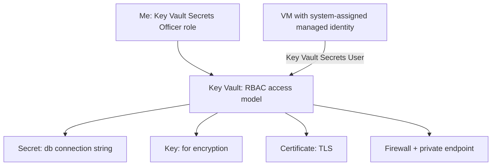

# 🔑 Azure Key Vault: Secrets, Keys and Access Models (AZ-104, portal-built)

This is the sixth lab in my AZ-104 set. Key Vault is not its own giant slice of the exam, but it sits underneath several things AZ-104 does test: customer-managed keys for storage and disk encryption, App Service certificates, and the recurring idea of keeping secrets out of code. The part that actually catches people is the access model, so this lab is built to make me hit that wall on purpose and climb over it.

**Exam status:** Not yet attempted. This lab builds Key Vault configuration, access control, and managed identity skills tested in AZ-104.

## 📋 The Scenario

**Fictional assignment:**
I have been handed an app that stores its database connection string in a config file on the server and told to **get it out of there and keep it somewhere secure**.

**Responsibilities:**

**✓ Secrets stay off laptops and out of source control**
- Store the connection string in Key Vault
- Store the TLS certificate there too
- No plaintext secrets in any file

**✓ The right people can read the right things**
- Understand the two access models and choose the correct one
- Prove that being subscription Owner is not enough to read a secret in RBAC mode

**✓ The VM reads secrets without a password of its own**
- Enable a managed identity on the VM
- Grant that identity access to the vault
- Read a secret from inside the VM without any stored credential

**✓ The vault is protected against accidental deletion**
- Understand soft delete and purge protection
- Know which one is optional and which one cannot be turned off once enabled

**What I learn:**
- The RBAC access model vs the vault access policy model
- Control plane vs data plane in the Key Vault context
- System-assigned vs user-assigned managed identities
- Soft delete and purge protection behaviour

The scenario that drives the work: an app needs a database connection string and a TLS certificate kept off laptops and out of source control. I have to decide who can read what, and let a VM read a secret without a password baked into it anywhere.

## 🏗️ What I build here



## 🧠 Core concepts

### Two access models

| | Azure RBAC model | Vault access policy model |
|---|---|---|
| How permissions are granted | Role assignments at the vault or higher scope | A per-principal list of allowed operations set directly on the vault |
| Granularity | Roles: Secrets User, Secrets Officer, Crypto User, Administrator | Tick boxes per principal: get, list, set, delete on secrets/keys/certs |
| Inherits from parent scope | Yes (subscription or resource group assignments apply) | No, set on the vault only |
| Microsoft recommendation | This one | Legacy, still supported |

### Control plane vs data plane

- **Control plane**: managing the vault resource (create it, delete it, change settings). Standard Azure RBAC. Owner or Contributor on the subscription covers this.
- **Data plane**: reading and writing the secrets, keys, and certificates inside the vault. Requires a specific Key Vault role (or vault access policy) even for a subscription Owner.

In the RBAC model, being Owner of the subscription means I can create and delete the vault. It does not mean I can read the secrets inside it. Those are separate permissions.

### Managed identity types

| | System-assigned | User-assigned |
|---|---|---|
| Tied to | One specific resource | Standalone identity resource |
| Lifecycle | Created and deleted with the resource | Independent lifetime |
| Shared across resources | No | Yes |

"One identity that several VMs share" = user-assigned. "An identity that disappears when the VM is deleted" = system-assigned.

## ✅ Before I started

- An Azure subscription where I am the Owner.
- A VM from an earlier lab for the managed identity phase, or a new small one.

## 🔐 Phase 1 - Create the vault and choose the access model

1. Search for **Key vaults** and select **Create**.
2. Set **Subscription** and **Resource group**.
3. Set **Key vault name**. The name must be globally unique across all of Azure. I used something like `kv-lab-<initials>`.
4. Set **Region** to my chosen region.
5. On the **Access configuration** tab, select **Azure role-based access control (RBAC)**.
6. Select **Review + create** > **Create**.

**Now try to add a secret straight away:**
1. Open the vault.
2. Select **Objects** > **Secrets** > **+ Generate/Import**.
3. Try to create any secret.

The portal returns a permission error. I cannot add a secret even though I just created the vault and I am the subscription Owner.

This is the lesson: under the RBAC model, adding secrets is a **data-plane** action. My Owner role covers the control plane (I can manage the vault resource). I need a separate data-plane role to read and write the contents.


*The vault created with Azure RBAC selected as the access model.*


*The error when trying to add a secret without a data-plane role assigned.*

## 👤 Phase 2 - Grant data-plane access, then add objects

**Assign a data-plane role to myself:**
1. Open the vault.
2. Select **Access control (IAM)** from the left menu.
3. Select **+ Add** > **Add role assignment**.
4. Search for and select **Key Vault Secrets Officer** (covers create, read, update, delete on secrets).
5. On the **Members** tab, assign it to my own account.
6. Select **Review + assign**.

Wait a minute or two for the role to propagate.

**Add objects to the vault:**
1. Select **Objects** > **Secrets** > **+ Generate/Import**.
2. Set **Name** to `db-connection-string`, set **Secret value** to a fake connection string.
3. Select **Create**.

4. Select **Objects** > **Keys** > **+ Generate/Import**.
5. Set **Key type** to **RSA**, **Key size** to **2048**. Give it a name and select **Create**.

6. Select **Objects** > **Certificates** > **+ Generate/Import**.
7. Set **Method** to **Generate**, **Certificate name** to `tls-cert`.
8. Fill in the subject (for example `CN=lab.example.com`) and select **Create**.


*Key Vault Secrets Officer role assigned at the vault scope.*


*The db-connection-string secret stored in the vault.*


*A key and a self-signed certificate added to the vault.*

## 📋 Phase 3 - The two access models side by side

I did not rebuild the vault to demonstrate this, but I read through both access configuration screens to understand the difference.

**RBAC model** (what I am using):
- Permissions are role assignments: Key Vault Secrets User, Key Vault Secrets Officer, Key Vault Crypto User, Key Vault Administrator.
- Assigned at the vault scope or inherited from resource group or subscription.
- Consistent with every other Azure RBAC assignment.

**Vault access policy model** (legacy, still supported):
- A list per principal: tick boxes for get, list, set, delete on secrets, keys, and certificates.
- Set on the vault directly. No inheritance from parent scopes.
- Older, still works, but Microsoft recommends migrating to RBAC.

The exam phrase to watch for: "a user can create and configure the vault but cannot read its secrets." That is the RBAC model with a missing data-plane role, not a policy misconfiguration.

## 🤖 Phase 4 - Let a VM read a secret without a password

**Enable system-assigned managed identity on the VM:**
1. Open the VM.
2. Select **Identity** from the left menu.
3. On the **System assigned** tab, set **Status** to **On**.
4. Select **Save**. Azure creates a service principal for this VM in Entra ID.

**Grant the VM's identity access to the vault:**
1. Open the vault.
2. Select **Access control (IAM)** > **+ Add** > **Add role assignment**.
3. Select **Key Vault Secrets User** (read-only on secrets).
4. On the **Members** tab, set **Assign access to** to **Managed identity**.
5. Select **+ Select members**, find the VM's managed identity, and select it.
6. Select **Review + assign**.

**Read the secret from inside the VM:**
1. SSH into the VM.
2. Request a token from the instance metadata service and use it to call Key Vault:

   ```bash
   TOKEN=$(curl -s "http://169.254.169.254/metadata/identity/oauth2/token?api-version=2018-02-01&resource=https://vault.azure.net" -H "Metadata: true" | python3 -c "import sys,json; print(json.load(sys.stdin)['access_token'])")

   curl -s "https://<vault-name>.vault.azure.net/secrets/db-connection-string?api-version=7.4" -H "Authorization: Bearer $TOKEN"
   ```

3. The response contains the secret value. No password was stored on the VM anywhere.


*System-assigned identity turned on. Azure created a service principal for the VM.*


*The VM retrieving the secret value from the OS with no stored credential.*

## 🛡️ Phase 5 - Protect the vault

**Soft delete:**
- On by default and **cannot be turned off**.
- Deleted secrets, keys, certificates, and the vault itself are retained for a configurable period (7 to 90 days, default 90).
- During this period, objects can be recovered.

**Purge protection:**
- Off by default and **optional**.
- Once turned on, it **cannot be turned off**.
- Nobody can permanently purge the vault or its objects until the full retention period has passed.
- Turn it on for vaults holding important or regulated data.

**How to enable purge protection:**
1. Open the vault.
2. Select **Properties** from the left menu.
3. Confirm soft delete is already On.
4. Under **Purge protection**, select **Enable purge protection**.
5. Select **Apply**.

**Networking:**
1. Select **Networking** from the left menu.
2. Set **Allow access from** to **Selected networks**.
3. Add a private endpoint following the same pattern as the storage lab.
4. This gives the vault a private IP inside the VNet.


*Soft delete is on by default. Purge protection enabled separately.*


*A private endpoint giving the vault a private IP inside the VNet.*

## 🔗 Where this connects to the rest of the exam

- **Storage and disk encryption**: customer-managed encryption keys live in Key Vault. The storage lab mentioned this as an option; this lab is where that key actually sits.
- **App Service**: TLS certificates for custom-domain HTTPS can be sourced from Key Vault, so they renew and rotate automatically.
- **Identity**: managed identities are the correct way for any Azure service to read from the vault without a credential. No secrets stored, no rotation needed.

## 🧯 Break it and fix it

I created the vault in RBAC mode and, as the subscription Owner, tried to add a secret. The portal refused with a permission error.

I read the error message carefully. It is a data-plane permission problem, not a control-plane problem. I have control-plane access (I created the vault). I lack data-plane access (I cannot write to it).

I went to **Access control (IAM)**, assigned myself **Key Vault Secrets Officer**, waited a minute for propagation, and tried again. It worked.

Doing this once makes the control-plane vs data-plane distinction stick in a way that reading about it does not.

## 🎯 Key points this lab reinforces

**Access models:**
- RBAC model: role assignments, inherits from parent scope, Microsoft-recommended.
- Vault access policy model: per-principal tick-box list, vault scope only, legacy.
- RBAC model still requires a data-plane role even for a subscription Owner.

**Control plane vs data plane:**
- Control plane: manage the vault resource (create, delete, settings).
- Data plane: read and write secrets, keys, certificates.
- Being Owner covers control plane. Data plane needs its own role assignment.

**Soft delete and purge protection:**
- Soft delete: always on, cannot be disabled.
- Purge protection: optional, but once enabled, cannot be disabled.

**Managed identities:**
- System-assigned: tied to one resource, dies with it.
- User-assigned: standalone, can be shared across multiple resources.
- Either type can be granted a Key Vault role to read secrets without a stored credential.

**Vault name:**
- Globally unique across all of Azure, same as storage account names.

## 🏭 If this were production, not a lab

- RBAC model only. No vault access policies.
- Purge protection enabled on every vault.
- Private endpoint with public access disabled.
- Every application and service uses a managed identity. No stored credentials anywhere.
- Secret rotation on a schedule, with alerts on expiry dates.
- Diagnostic logs from the vault sent to Log Analytics so every secret read is auditable.

---
*Part of my AZ-104 hands-on set. Built in the portal. See `cli-reference/commands.md` for the same steps as `az` commands.*
