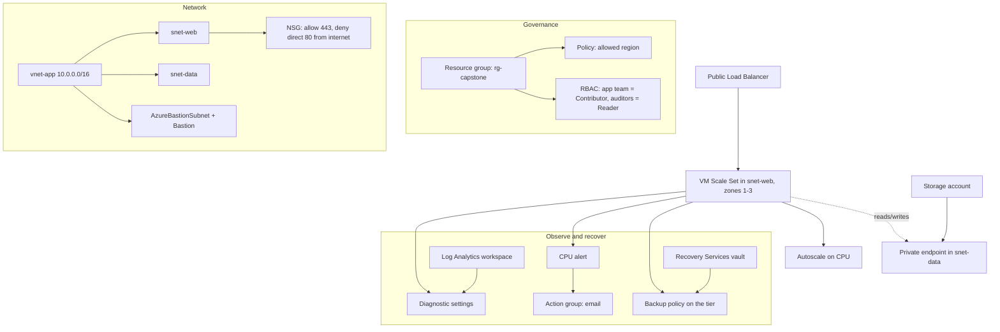

# 🏁 Capstone: A Small Web App, End to End (AZ-104, portal-built)

This is the seventh and final lab in my AZ-104 set. Instead of practising one domain at a time, here I stand up a small internal web application the way I actually would: a network to put it in, a scalable web tier, somewhere private to keep its data, the right people with the right access, and enough monitoring and backup to sleep at night.

If labs 1-6 are the individual pieces, this is how they fit together. Do them first. This one assumes I have already built each piece on its own and now have to make them work as one system, in the right order, with the dependencies between them.

**Exam status:** Not yet attempted. This capstone connects all AZ-104 domains into a single end-to-end deployment.

## 📋 The Scenario

**Fictional assignment:**
The team needs an **internal web application**. I am building the whole platform from scratch.

**Responsibilities:**

**✓ Governance is in place before any resource is created**
- Resource group with an allowed-region policy
- RBAC: app team as Contributor, auditors as Reader

**✓ The network is ready before compute lands in it**
- VNet with web, data, and Bastion subnets
- NSG on the web subnet
- Azure Bastion for admin access, no public IP on any VM

**✓ The web tier scales and survives zone failures**
- VM Scale Set across zones 1-3 behind a Standard Load Balancer
- Autoscale rule wired and tested

**✓ Application data never touches the public internet**
- Storage account with a private endpoint in the data subnet
- Private DNS linked so the private name resolves correctly

**✓ The system is observable and recoverable**
- Log Analytics workspace with diagnostic settings
- CPU alert wired to an action group
- Recovery Services vault with a backup policy

**What I learn:**
- The correct deployment order when resources depend on each other
- How the five domains (governance, network, compute, storage, monitoring) wire together
- The failure points at the seams between services

## 🏗️ What I build here

## 🧠 The order matters: this is the main lesson

Resources depend on each other. Getting the order wrong causes deployment failures, and this is exactly what multi-step exam questions test.

| Phase | What I build | Why this order |
|---|---|---|
| 1. Governance | Resource group + policy + RBAC | Guardrails must exist before any resource does |
| 2. Network | VNet + subnets + NSG + Bastion | Compute and private endpoints both land inside the network |
| 3. Compute | VMSS + load balancer + autoscale | Web tier sits in the VNet I just created |
| 4. Storage | Storage account + private endpoint | Private endpoint lands in the data subnet |
| 5. Monitoring | Log Analytics + alerts + backup | Diagnostic settings point at the workspace, which must exist first |

## ✅ Before I started

- Labs 01 through 06 completed, or comfortable with each individual piece.
- A subscription with room for a scale set and supporting resources.
- Budget around 60 to 90 minutes. The value here is the order and the wiring, not any single resource.
- Delete the resource group when done. Scale sets run real VMs.

## 🏛️ Phase 1 - Governance first

1. Search for **Resource groups** and select **Create**.
2. Set **Name** to `rg-capstone` and choose the **Region**.
3. Select **Review + create** > **Create**.

**Assign the allowed-region policy:**
1. Search for **Policy** and open it.
2. Select **Assignments** > **+ Assign policy**.
3. Set **Scope** to `rg-capstone`.
4. Select the built-in **Allowed locations** policy definition.
5. On the **Parameters** tab, select the region I am using.
6. Select **Review + create** > **Create**.

**Assign RBAC roles:**
1. Open `rg-capstone`.
2. Select **Access control (IAM)** > **+ Add** > **Add role assignment**.
3. Assign **Contributor** to the app team user or group.
4. Repeat to assign **Reader** to the auditor user or group.

**Why governance first:**
Every resource created after this point lands inside the policy scope. If I create resources first and add policies later, I get existing non-compliant resources that need remediation.

*The resource group with the allowed-region policy applied.*

*Contributor for the app team, Reader for auditors.*

## 🌐 Phase 2 - Network before compute

**Create the VNet and subnets:**
1. Search for **Virtual networks** and select **Create**.
2. Set **Resource group** to `rg-capstone`, **Name** to `vnet-app`.
3. Set **Address space** to `10.0.0.0/16`.
4. On the **Subnets** tab, add:
   - `snet-web`: `10.0.1.0/24`
   - `snet-data`: `10.0.2.0/24`
   - `AzureBastionSubnet`: `10.0.3.0/26` (exact name required, /26 or larger)
5. Select **Review + create** > **Create**.

**Add an NSG to the web subnet:**
1. Search for **Network security groups** and select **Create**.
2. Set **Resource group** to `rg-capstone` and give it a name.
3. After creation, select **Inbound security rules** > **+ Add**.
4. Add a rule: allow TCP port 443 at priority 100.
5. Add another rule: deny TCP port 80 from internet at priority 200.
6. Attach the NSG to `snet-web`: open the subnet, set **Network security group**.

**Deploy Azure Bastion:**
1. Search for **Bastions** and select **Create**.
2. Set **Resource group** to `rg-capstone`, **Name** to `bastion-capstone`.
3. Set **Virtual network** to `vnet-app`. The `AzureBastionSubnet` is picked automatically.
4. Create a new public IP for Bastion.
5. Select **Review + create** > **Create**.

**Why network before compute:**
The scale set has to live in `snet-web`, and the private endpoint lands in `snet-data`. Both subnets need to exist before I can deploy into them.

*vnet-app with snet-web, snet-data, and AzureBastionSubnet.*

*Allow 443 at priority 100, deny 80 at priority 200.*

## ⚙️ Phase 3 - The web tier

**Deploy the VM Scale Set:**
1. Search for **Virtual machine scale sets** and select **Create**.
2. Set **Resource group** to `rg-capstone`, **Name** to `vmss-capstone`.
3. Set **Availability zones** to **1, 2, 3**.
4. Pick a small Linux image and a small SKU.
5. On the **Networking** tab, set **Virtual network** to `vnet-app` and **Subnet** to `snet-web`.
6. Under **Load balancing**, select **Azure load balancer** and let it create a Standard public load balancer.
7. On the **Advanced** tab, paste a cloud-init script to install nginx and echo the hostname.
8. Select **Review + create** > **Create**.

**Add the autoscale rule:**
1. Open the scale set.
2. Select **Scaling** > **Custom autoscale**.
3. Set min `2`, max `5`, default `2`.
4. Add a scale-out rule: CPU > 70% over 5 minutes, increase count by 1.
5. Add a scale-in rule: CPU < 30% over 5 minutes, decrease count by 1.
6. Save.

**Verify the web tier works:**
- Open the load balancer's public IP in a browser.
- Refresh several times. The hostname in the response should change as the load balancer distributes to different instances.

*Scale set instances registered in the load balancer backend pool.*

*Scale-out at CPU over 70%, scale-in at CPU under 30%.*

*The web page served through the load balancer public IP.*

## 💾 Phase 4 - Private data

**Create the storage account:**
1. Search for **Storage accounts** and select **Create**.
2. Set **Resource group** to `rg-capstone`.
3. Set **Redundancy** to LRS (enough for this lab).
4. On the **Networking** tab, set **Network access** to **Disable public access and use private access**.
5. Select **Review + create** > **Create**.

**Create the private endpoint:**
1. Open the storage account.
2. Select **Networking** > **Private endpoint connections** > **+ Private endpoint**.
3. Set **Resource group** to `rg-capstone`, give it a name.
4. Set **Target sub-resource** to `blob`.
5. Set **Virtual network** to `vnet-app`, **Subnet** to `snet-data`.
6. On the **DNS** tab, set **Integrate with private DNS zone** to **Yes**.
7. Select **Review + create** > **Create**.

**The DNS step:**
The private endpoint creates a private IP (for example `10.0.2.5`) for the storage account. But the VMs still try to resolve `mystorageaccount.blob.core.windows.net`, which points to a public IP. The Private DNS zone (`privatelink.blob.core.windows.net`) overrides that resolution for resources inside the VNet, so the name resolves to the private IP instead. Without this step, the storage account is unreachable over the private endpoint.

*The private endpoint for blob storage landing in snet-data.*

*The private DNS zone resolving the storage account name to a private IP.*

## 📊 Phase 5 - See it and protect it

**Log Analytics workspace and diagnostics:**
1. Search for **Log Analytics workspaces** and select **Create**.
2. Set **Resource group** to `rg-capstone`, **Name** to `law-capstone`.
3. After creation, open the scale set.
4. Select **Diagnostic settings** > **+ Add diagnostic setting**.
5. Tick **AllMetrics** and point it at `law-capstone`.
6. Save.

**CPU alert:**
1. Search for **Monitor** > **Alerts** > **+ Create** > **Alert rule**.
2. Scope: the scale set.
3. Condition: Percentage CPU > 80% over 5 minutes.
4. Create an action group with an email notification.
5. Attach the action group and create the rule.
6. Generate CPU load on an instance and wait for the alert email to arrive.

**Recovery Services vault:**
1. Search for **Recovery Services vaults** and select **Create**.
2. Set **Resource group** to `rg-capstone`, **Name** to `rsv-capstone`.
3. After creation, select **Backup** > Azure VM > select one scale set instance.
4. Accept the default backup policy (daily, 30-day retention).
5. Select **Enable Backup**.

*Scale set diagnostic settings sending metrics to the Log Analytics workspace.*

*The CPU alert email confirming the action group is wired correctly.*

*Daily backup with 30-day retention on a scale set instance.*

## ✅ Prove it works as one system

Run through these five checks. If all pass, the system is working end to end.

1. **Web tier reachable:** Hit the load balancer public IP and confirm the page loads. Refresh a few times and see different hostnames responding.

2. **No public IP on VMs:** Open any scale set instance. Confirm it has no public IP. Open a Bastion session to it from the browser and confirm admin access works.

3. **Storage is private:** From inside a scale set instance (via Bastion), run `curl` against the storage blob endpoint with a valid SAS token. It should resolve to the private IP. From a laptop outside the VNet, the same request should fail.

4. **Autoscale fires:** Run a CPU stress load on one or more instances. Watch the scale set instance count increase and confirm the alert email arrives at roughly the same time.

5. **Restore works:** Delete one scale set instance manually. Restore it from the Recovery Services vault backup and confirm it rejoins the backend pool.

## 🧯 Break it and fix it

I skipped the Private DNS step in Phase 4 on purpose. After deploying the private endpoint, I tried to reach the storage account from inside a scale set instance.

The VMs resolved `mystorageaccount.blob.core.windows.net` to the public IP. The storage firewall blocked public access. The request failed.

I diagnosed it:
1. Ran `nslookup mystorageaccount.blob.core.windows.net` from inside the VM. It returned the public IP.
2. That confirmed DNS was not resolving to the private IP.
3. Went to the private endpoint in the portal. Confirmed the private DNS zone was not linked to the VNet.
4. Linked the private DNS zone to `vnet-app`.
5. Ran `nslookup` again. It returned the private IP.
6. The storage request succeeded.

DNS is the failure point at the seam between private endpoints and VNets. This fix teaches more than any diagram.

## 🎯 Key points this lab reinforces

**Order:**
- Governance before resources. Network before compute. DNS before private endpoint traffic.
- If a resource depends on another, the dependency must exist first.

**Seams to watch:**
- Private endpoint + missing DNS = unreachable storage, confusing error.
- Diagnostic settings + missing workspace = no log data, KQL returns nothing.
- Alert rule + no action group = alert fires in portal, nobody is told.
- NSG + wrong priority = traffic blocked unexpectedly, check effective security rules.

**Five domains working together:**
- Governance: policy guardrails set before any resource exists.
- Network: VNet, subnets, NSG, Bastion set up before compute.
- Compute: VMSS with zones and autoscale behind a standard load balancer.
- Storage: private endpoint with DNS so traffic stays inside the VNet.
- Monitoring: Log Analytics, metric alert with action group, backup policy.

## 📝 What this project proves

- I can sequence a deployment so dependencies resolve in the right order.
- I understand how identity, network, compute, storage, and monitoring connect, not just each one alone.
- I can troubleshoot the seams between services: private endpoint plus DNS, diagnostic settings plus workspace, NSG plus effective rules.

## 🏭 If this were production, not a lab

- App Gateway with WAF would sit in front of the load balancer for Layer 7 inspection and SSL offload.
- Azure Firewall in a hub VNet would inspect traffic between subnets and to the internet.
- Storage would use RBAC data roles for access instead of SAS tokens.
- Logs from every subscription would land in one centralised Log Analytics workspace.
- Backup restores would be tested on a schedule. Untested restores are not trusted restores.

---
*Capstone of my AZ-104 hands-on set. Built in the portal. See `cli-reference/commands.md` for the same steps as `az` commands.*
